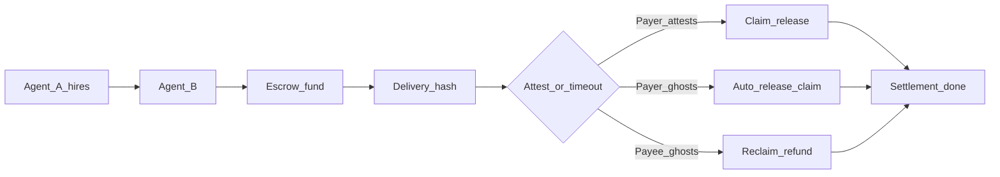

# Pharos Settle

**Stripe Checkout for AI agents on Pharos** — a trust layer for agents that hire each other.

[](#tests) [-blue)](deployments/atlantic.json) [](docs/PHASES.md)

> **Agent-to-agent work settlement with ghost protection.**  
> Payee ghosts → payer reclaims. Payer ghosts → payee still gets paid. Both behave → instant settlement.

**Hackathon judges → [JUDGES.md](JUDGES.md)** (mock demo first, no keys) · [SUBMISSION.md](SUBMISSION.md) · **Any IDE → [AGENTS.md](AGENTS.md)** · [MCP other IDEs](docs/mcp/other-ides.md)

### Workflow parameters

Reuse the same flow for any payer, payee, token, or task — demos are just one filled-in example.

| Parameter | Field | Example |
|-----------|-------|---------|
| Payer | `agentA` | `PRIVATE_KEY` wallet |
| Payee | `agentB` | Worker address |
| Token | `token` | TEST / USDC / USDT / WBTC / WETH / WPHRS — [`deployments/atlantic.json`](deployments/atlantic.json) |
| Amount | `amount` (wei) | `10000000000000000000` = 10 TEST |
| Task | `workDescription` | `competitor-pricing-crawl-2026-06` |
| Network | `deploymentNetwork` | `atlantic` (default) or `localhost` |
| Mode | `mode` | `cooperative` \| `safetyNet` |

### Who hires whom

| Scenario | Payer agent | Payee agent | What gets settled |
|----------|-------------|-------------|-----------------|
| Market intel | Research agent | Scraping agent | Competitor pricing crawl delivered on-chain |
| Pre-trade check | Trading agent | Risk-analysis agent | VaR report before order execution |
| DAO ops | DAO assistant | Summarizer agent | Proposal brief before vote deadline |
| Microtask payroll | Labeling coordinator | 100 worker agents | **SALI FastPay** — batch fund+claim in parallel blocks |

### Agent economy primitive



Reusable on Pharos Atlantic: four contracts, one state machine, Skill + 15 MCP tools.

### Example agent transcript

```
User:     Pay 1 TEST to the research agent if it delivers the market report.
Pharos Settle: Preflight passed. Fee: 0.5%. nextAction: fund.
Research: Delivery submitted (resultHash bound to report).
Pharos Settle: Payer attested. Claim complete. dealId=42 · PharosScan ✓
```

---

## What this is

| Piece | Description |
|-------|-------------|
| **Contracts** | SettlementRouter · DealEscrow · AgentRegistry · TokenAllowlist |
| **SDK** | `simulateTrustedSettlement` / `executeTrustedSettlement` + `nextAction` hints |
| **MCP** | `npm run mcp` — 15 tools; payer/payee split + batch (`saliFast` / `hybridWork`) |
| **Skill** | [`skills/trusted-agent-settlement/`](skills/trusted-agent-settlement/SKILL.md) — Pharos Settle Skill module (15 MCP tools) |

**Why four contracts?** [SettlementRouter enforces access, DealEscrow owns state and funds, AgentRegistry separates identity from payment logic, TokenAllowlist keeps the attack surface minimal.](docs/architecture/overview.md#on-chain-contracts)

```typescript
import { simulateTrustedSettlement, executeTrustedSettlement } from "./src/trustedAgentSettlement.js";

const sim = await simulateTrustedSettlement(input, { mode: "cooperative" });
console.log(sim.nextAction, sim.feeQuote); // fund | deliver | attest | claim | done

if (sim.stages.preflight.ready) {
  await executeTrustedSettlement(input, { mode: "cooperative", autoOnboardRecipients: true });
}
```

---

## Quick start (< 2 minutes)

**Both demo wallets are pre-registered on Atlantic — clone, add keys to `.env`, run `npm run demo:pharos`.**

```bash
npm run setup          # install, build, skill + MCP config
# Open this repo as workspace root → Reload MCP in Cursor
cp .env.example .env   # PRIVATE_KEY + AGENT_B_PRIVATE_KEY
npm run demo:pharos    # first time only: deploy:pharos && seed:pharos once before this
```

Deploy from scratch:

```bash
npm run deploy:pharos
npm run seed:pharos    # registers both .env wallets + allows TEST + Atlantic tokens
npm run demo:pharos
```

---

## Live on Pharos Atlantic

Addresses in [`deployments/atlantic.json`](deployments/atlantic.json) (on-chain verified).

| Contract | Address |
|----------|---------|
| SettlementRouter | `0x4c6e7be366dc9c4c358f85faa98a471fdaa4ad94` |
| DealEscrow | `0xd019258710faf17d0952c91d66e0e11e5631c814` |
| AgentRegistry | `0x8871d3538153eae0711fa6d01a0ed311a6b13e17` |
| TokenAllowlist | `0x37e128f57732e951f8f2aecf8bce6129ebc08b21` |
| TEST token | `0xde18fab2b974db730aeda8c6187ba37b1d6a3be9` |

Explorer: [atlantic.pharosscan.xyz](https://atlantic.pharosscan.xyz) · RPC: `https://atlantic.dplabs-internal.com`

---

## Demos

| Command | What it shows |
|---------|----------------|
| `npm run demo:pharos` | End-to-end cooperative settlement on Atlantic |
| `npm run demo:simulate` | Preflight + fee quote (no gas) |
| `npm run demo:batch` | SALI batch (`saliFast`, BATCH_SIZE=5) |
| `npm run demo:batch:simulate` | Batch flow in mock mode |
| `npm run demo:batch:split` | Two-agent batch handoff (saliFast or hybridWork) |
| `npm run demo:ghost-payer` | Payee paid after payer ghosts |
| `npm run demo:agent` | Generic agent uses Skill (no settlement code) |
| `npm run demo:pipeline` | Composable Layer 2 pipeline |

## MCP (plug-and-play agents)

```bash
npm run mcp
```

Cursor setup: [docs/mcp/setup.md](docs/mcp/setup.md)

**Plug in as payer or payee** — one key per MCP. See [docs/mcp/setup.md](docs/mcp/setup.md) and [docs/mcp/roles.md](docs/mcp/roles.md).

**Tools (15):** single-payment + batch — see [docs/mcp/batch-sali.md](docs/mcp/batch-sali.md) for `saliFast` vs `hybridWork`

```bash
npm run agent:doctor        # readiness check
npm run agent:doctor:mock   # no keys
```

Legacy HTTP bridge: `npm run mcp:http`

---

## Ghost protection & settlement modes

| Who ghosts? | Outcome |
|-------------|---------|
| Payee never delivers | Payer **reclaims** (`safetyNet`) |
| Payer never attests | Payee **still gets paid** (auto-release) |
| Both cooperate | **Instant settlement** — fund → deliver → attest → claim |

`getSettlementStatus` returns `nextAction` so agents always know the single next step.

---

## Why Pharos

- **Sub-second finality** — measured on every settlement
- **SALI FastPay** (*batch agent payroll*) — one payer, many worker agents, parallel settlement on Atlantic; `saliFast` mode lands N fund+claim txs in the same block (`npm run demo:batch`)
- **Batch agent commerce** — `hybridWork` runs full deliver→attest→claim at scale across two MCP agents (`npm run demo:batch:split`)
- **Payer-sponsored onboarding** — `registerRecipients` before first payment
- **Registered agents + allowlisted tokens + hybrid escrow**

```typescript
import { executeBatchSettlement, fundDealsBatch, claimDealsBatch } from "./src/trustedAgentSettlement.js";

// SALI FastPay — demo shortcut (both keys)
const batch = await executeBatchSettlement(jobs, { batchMode: "saliFast", deploymentNetwork: "atlantic" });

// Two-agent split: payer funds → workers claim from manifest
const funded = await fundDealsBatch(jobs, { batchMode: "saliFast" });
const claimed = await claimDealsBatch(funded.manifest.map((m) => ({
  dealId: m.dealId, fundTx: m.fundTx, amount: m.amount, agentB: m.agentB,
})));
```

---

## Tests

```bash
npm test   # 103 tests — 37 Hardhat + 66 Vitest (Atlantic smoke needs seeded wallets)
```

| Tier | Path |
|------|------|
| Contracts | `test/contracts/` |
| SDK integration | `test/integration/` |
| Unit | `test/unit/` |
| MCP | `test/mcp/` |
| Atlantic smoke | `test/atlantic/` |

---

## Documentation

| Doc | Purpose |
|-----|---------|
| **[JUDGES.md](JUDGES.md)** | Judge quickstart (mock first) |
| **[SUBMISSION.md](SUBMISSION.md)** | Full submission + DoraHacks |
| **[docs/README.md](docs/README.md)** | Full handbook |
| **[docs/mcp/batch-sali.md](docs/mcp/batch-sali.md)** | SALI FastPay — batch agent payroll |
| **[docs/PHASES.md](docs/PHASES.md)** | Phase 1 (shipped) vs Phase 2 (planned) |
| **[skills/.../SKILL.md](skills/trusted-agent-settlement/SKILL.md)** | Agent Skill — composable patterns + step table |

**Composable API (Layer 2):**

```typescript
import { preflight, settle, prove, submitDelivery, attestRelease } from "./src/steps.js";
```

---

*Repo / package name: `pharos-trusted-settlement` · Pharos Atlantic testnet · Pharos Settle Skill*
