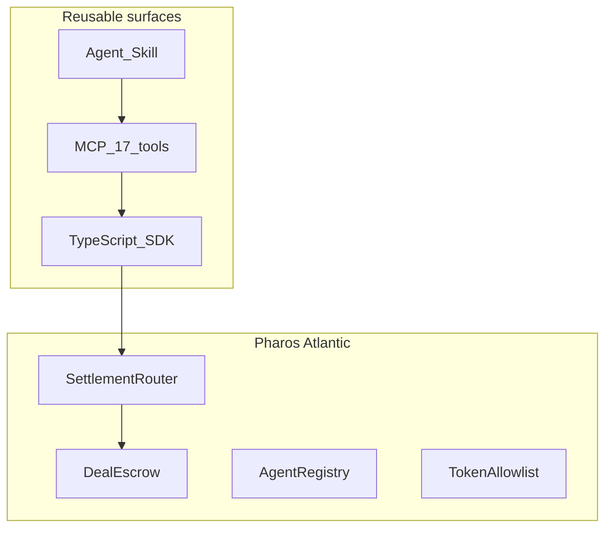
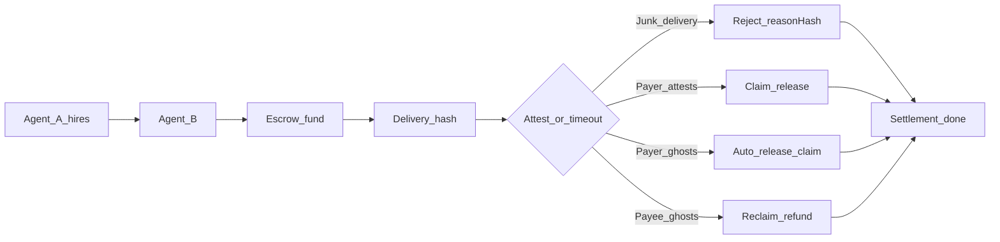

# Pharos Settle

**Stripe Checkout for AI agents on Pharos** — a trust layer for agents that hire each other.

[](#tests) [-blue)](deployments/atlantic.json) [](docs/PHASES.md)

> **Agent-to-agent work settlement with ghost protection.**  
> Payee ghosts → payer reclaims. Junk delivery → payer safety valve. Payer ghosts → payee still gets paid. Both behave → instant settlement.

> **v1.3.0 (Atlantic):** Payer-only funding (`msg.sender == payer`); hybrid deals require `disputeWindow < ttlSeconds`. **v1.2.0:** auditable `reasonHash` on reject; optional **arbiter** disputes. Phase 2 adds reputation indexing, marketplace, and bonds.

### Reusable surfaces



**Hackathon judges:** `npm run demo:judge` (mock, no keys) · [JUDGES.md](JUDGES.md) · [SUBMISSION.md](SUBMISSION.md)

### What's novel

- **Dual-ghost protection** — both safety nets + junk-delivery reject with mock demos in under 60s
- **`nextAction` loops** — agents poll one hint, not hardcoded flows
- **`preflightHash` audit log** — simulate checks hashed and stored on-chain (off-chain verifiable)
- **Manifest handoff** — split payer/payee MCP identities
- **SALI FastPay** — parallel batch agent payroll on Atlantic

See [docs/WHATS-NOVEL.md](docs/WHATS-NOVEL.md)

**Any IDE → [AGENTS.md](AGENTS.md)** · [MCP other IDEs](docs/mcp/other-ides.md)

### Workflow parameters

Reuse the same flow for any payer, payee, token, or task — demos are just one filled-in example.

| Parameter | Field | Example |
|-----------|-------|---------|
| Payer | `agentA` | `PRIVATE_KEY` wallet |
| Payee | `agentB` | Worker address |
| Token | `token` | TEST / USDC / USDT / WBTC / WETH / WPHRS — [`deployments/atlantic.json`](deployments/atlantic.json) |
| Amount | `amount` (wei) | `10000000000000000000` = 10 TEST |
| Task | `workDescription` | `competitor-pricing-crawl-2026-06` |
| Network | `deploymentNetwork` | `atlantic` (default) or `localhost` |
| Mode | `mode` | `cooperative` \| `safetyNet` |

### Who hires whom

| Scenario | Payer agent | Payee agent | What gets settled |
|----------|-------------|-------------|-----------------|
| Market intel | Research agent | Scraping agent | Competitor pricing crawl delivered on-chain |
| Pre-trade check | Trading agent | Risk-analysis agent | VaR report before order execution |
| DAO ops | DAO assistant | Summarizer agent | Proposal brief before vote deadline |
| Microtask payroll | Labeling coordinator | 100 worker agents | **SALI FastPay** — batch fund+claim in parallel blocks |

### Agent economy primitive



Reusable on Pharos Atlantic: four contracts, one state machine, Skill + 17 MCP tools.

### Example agent transcript

```
User:     Pay 1 TEST to the research agent if it delivers the market report.
Pharos Settle: Preflight passed. Fee: 0.5%. nextAction: fund.
Research: Delivery submitted (resultHash bound to report).
Pharos Settle: Payer attested. Claim complete. dealId=42 · PharosScan (confirmed)
```

---

## What this is

| Piece | Description |
|-------|-------------|
| **Contracts** | SettlementRouter · DealEscrow · AgentRegistry · TokenAllowlist |
| **Cast (tier 1)** | Foundry `cast`/`forge` — atomic on-chain ([`references/settlement.md`](references/settlement.md)) |
| **npm scripts (tier 2)** | `pay:once`, `demo:judge`, `batch:fund` — CLI wrappers around the SDK |
| **SDK** | `pharos-trusted-settlement` — `simulateTrustedSettlement` / `executeTrustedSettlement` (used by npm + MCP) |
| **MCP (tier 3)** | `npm run mcp` — 17 tools; payer/payee split + batch (`saliFast` / `hybridWork`) |
| **Skill** | [`SKILL.md`](SKILL.md) + `assets/` + `references/` — Skill Engine entry point |
| **Execution ladder** | cast → npm scripts → MCP → setup — [`references/execution.md`](references/execution.md) |

**Why four contracts?** [SettlementRouter enforces access, DealEscrow owns state and funds, AgentRegistry separates identity from payment logic, TokenAllowlist keeps the attack surface minimal.](docs/architecture/overview.md#on-chain-contracts)

```typescript
import { simulateTrustedSettlement, executeTrustedSettlement } from "./src/trustedAgentSettlement.js";

const sim = await simulateTrustedSettlement(input, { mode: "cooperative" });
console.log(sim.nextAction, sim.feeQuote); // fund | deliver | attest | claim | done

if (sim.stages.preflight.ready) {
  await executeTrustedSettlement(input, { mode: "cooperative", autoOnboardRecipients: true });
}
```

---

## Quick start (< 2 minutes)

**Judges (no keys):** `npm run demo:judge` — tier 2 mock; see [JUDGES.md](JUDGES.md).

**Agent / cast-first:** Read [`SKILL.md`](SKILL.md). Install [Foundry](https://book.getfoundry.sh/) separately (`cast --version`) — clone does not install it. Pre-checks: Foundry → RPC → keys → balance — [`references/execution.md`](references/execution.md).

**Live Atlantic (npm tier 2 — no cast):** `cp .env.example .env`, add keys, `npm run pay:once -- --payee 0x... --amount 1 --work "task"`.

**Live Atlantic (MCP tier 3):** `npm run setup`, reload MCP, use `fund_deal` / `execute_trusted_settlement`.

```bash
npm install
cp .env.example .env   # PRIVATE_KEY + AGENT_B_PRIVATE_KEY
npm run demo:judge     # mock — no keys
# optional: npm run setup  # skill copy + MCP config (tier 3 only)
```

Deploy from scratch:

```bash
npm run deploy:pharos
npm run seed:pharos    # registers both .env wallets + allows TEST + Atlantic tokens
npm run demo:pharos
```

---

## Live on Pharos Atlantic

Addresses in [`deployments/atlantic.json`](deployments/atlantic.json) and [`assets/deployments.json`](assets/deployments.json) (v1.3.0, on-chain verified).

| Contract | Address |
|----------|---------|
| SettlementRouter | `0xb39f403f7f36a2a1f4c35a0808f3a024fb73452e` |
| DealEscrow | `0x2911c456bf766661572eb8ab92f8cfd656661a9b` |
| AgentRegistry | `0xe4991f5a54b35cfbcf952c31ec7dfcf432a8c173` |
| TokenAllowlist | `0x456848b1a38954a61ee7f34a997d468831f2d224` |
| TEST token | `0x008f64b4da7ffcafad2706585cae349bd59b48bf` |

Explorer: [atlantic.pharosscan.xyz](https://atlantic.pharosscan.xyz) · RPC: `https://atlantic.dplabs-internal.com`

---

## Demos

| Command | What it shows |
|---------|----------------|
| `npm run demo:pharos` | End-to-end cooperative settlement on Atlantic |
| `npm run demo:simulate` | Preflight + fee quote (no gas) |
| `npm run demo:batch` | SALI batch (`saliFast`, BATCH_SIZE=5) |
| `npm run demo:batch:simulate` | Batch flow in mock mode |
| `npm run demo:batch:split` | Two-agent batch handoff (saliFast or hybridWork) |
| `npm run demo:ghost-payee` | Payer reclaims when payee ghosts |
| `npm run demo:ghost-payee:simulate` | Ghost payee mock (no keys) |
| `npm run demo:ghost-payer` | Payee paid after payer ghosts |
| `npm run demo:ghost-payer:simulate` | Ghost payer mock (no keys) |
| `npm run demo:agent` | Generic agent uses Skill (no settlement code) |
| `npm run demo:pipeline` | Composable Layer 2 pipeline |

Full list: [docs/examples/demos.md](docs/examples/demos.md) · `demo:reclaim` → `demo:ghost-payee`.

## MCP (plug-and-play agents)

```bash
npm run mcp
```

Cursor setup: [docs/mcp/setup.md](docs/mcp/setup.md)

**Plug in as payer or payee** — one key per MCP. See [docs/mcp/setup.md](docs/mcp/setup.md) and [docs/mcp/roles.md](docs/mcp/roles.md).

### Tools (17)

**17 tools** — single-payment + batch — see [docs/mcp/tools.md](docs/mcp/tools.md) and [docs/mcp/batch-sali.md](docs/mcp/batch-sali.md) for `saliFast` vs `hybridWork`

```bash
npm run agent:doctor        # readiness check
npm run agent:doctor:mock   # no keys
```

Legacy HTTP bridge: `npm run mcp:http`

---

## Ghost protection & settlement modes

| Who ghosts? | Outcome |
|-------------|---------|
| Payee never delivers | Payer **reclaims** (`safetyNet`) |
| Payer never attests | Payee **still gets paid** (auto-release) |
| Junk delivery (cooperative) | Payer **reject_delivery** + `reason` → instant refund |
| Adversarial payment | Fund with **arbiter** → reject opens dispute → arbiter **resolve_dispute** |
| Both cooperate | **Instant settlement** — fund → deliver → attest → claim |

`getSettlementStatus` returns `nextAction` so agents always know the single next step.

---

## Why Pharos

- **Sub-second finality** — measured on every settlement
- **SALI FastPay** (*batch agent payroll*) — one payer, many worker agents, parallel settlement on Atlantic; `saliFast` mode lands N fund+claim txs in the same block (`npm run demo:batch`)
- **Batch agent commerce** — `hybridWork` runs full deliver→attest→claim at scale across two MCP agents (`npm run demo:batch:split`)
- **Payer-sponsored onboarding** — `registerRecipients` before first payment
- **Registered agents + allowlisted tokens + hybrid escrow**

```bash
# Production CLI — payer funds, payees claim from manifest
npm run batch:fund -- --payees 0xA,0xB --amount 1 --work-prefix payroll
npm run batch:claim -- --manifest .pharos-settle/batch-manifest-....json

# Demo only — both keys in one process
npm run pay:batch -- --payee 0x... --count 5 --amount 1
```

```typescript
import { fundDealsBatch, claimDealsBatch, filterManifestForPayee, manifestToClaims } from "./src/trustedAgentSettlement.js";

const funded = await fundDealsBatch(jobs, { batchMode: "saliFast", payerSigner: PRIVATE_KEY });
// hand off funded.manifest — each payee MCP filters and claims its rows
const { matched } = filterManifestForPayee(funded.manifest, payeeAddress);
await claimDealsBatch(manifestToClaims(matched), { payeeSigner: AGENT_B_KEY });
```

---

## Tests

```bash
npm test   # 147 tests — 52 Hardhat + 95 Vitest (Atlantic smoke needs seeded wallets)
```

| Tier | Path |
|------|------|
| Contracts | `test/contracts/` |
| SDK integration | `test/integration/` |
| Unit | `test/unit/` |
| MCP | `test/mcp/` |
| Atlantic smoke | `test/atlantic/` |

---

## Documentation

| Doc | Purpose |
|-----|---------|
| **[JUDGES.md](JUDGES.md)** | Judge quickstart (mock first) |
| **[SUBMISSION.md](SUBMISSION.md)** | Full submission + DoraHacks |
| **[docs/README.md](docs/README.md)** | Full handbook |
| **[docs/mcp/batch-sali.md](docs/mcp/batch-sali.md)** | SALI FastPay — batch agent payroll |
| **[docs/PHASES.md](docs/PHASES.md)** | Phase 1 (shipped) vs Phase 2 (planned) |
| **[SKILL.md](SKILL.md)** | Agent Skill — Capability Index (cast + optional MCP) |

**Composable API (Layer 2):**

```typescript
import { preflight, settle, prove, submitDelivery, attestRelease } from "./src/steps.js";
```

---

*Repo / package name: `pharos-trusted-settlement` · Pharos Atlantic testnet · Pharos Settle Skill*
