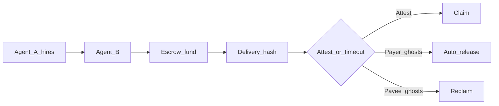

# Pharos Settle — Hackathon submission

**Judges → start with [JUDGES.md](JUDGES.md)** (mock demo first, no keys).

**Stripe Checkout for AI agents on Pharos** · Agent-to-agent work settlement with **ghost protection**.

**Package:** `pharos-trusted-settlement` · **Network:** Pharos Atlantic (`688689`) · **Tests:** 145 green

### What's novel

- **Dual-ghost protection** — payee ghosts → reclaim; payer ghosts → auto-release claim; junk delivery → reject
- **`nextAction` loops** — agents poll one hint instead of hardcoding flows
- **`preflightHash` audit log** — simulate checks hashed and stored on-chain (off-chain verifiable; contracts do not enforce)
- **Manifest handoff** — split payer/payee MCPs without mixing keys
- **SALI FastPay** — parallel batch agent payroll on Atlantic

→ Full comparison: [docs/WHATS-NOVEL.md](docs/WHATS-NOVEL.md) · Threat model: [docs/security/threat-model.md](docs/security/threat-model.md)

---

## Shipped vs planned

| ✅ Shipped (Phase 1) | ⚠️ Not shipped (Phase 2) |
|----------------------|--------------------------|
| Smart contracts (4 + TEST token) | Agent marketplace |
| TypeScript SDK | Reputation scores |
| MCP server — 17 tools | On-chain arbitration |
| Agent Skill module | |
| Live Atlantic deployment | |
| 145 tests (50 Hardhat + 95 Vitest) | |
| Cooperative junk review (`reject_delivery` safety valve) | |

Roadmap detail: [docs/PHASES.md](docs/PHASES.md) · Threat model: [docs/security/threat-model.md](docs/security/threat-model.md)

---

## What it is (human terms)

One AI agent hires another. Money locks in escrow until work is proven. Then pay, timeout-pay, or refund.

**Ghost protection:**

| If… | Then… |
|-----|-------|
| Worker never delivers | Payer gets money back |
| Worker submits junk delivery | Payer **safety valve** during dispute window (`reject_delivery`, cooperative review) |
| Payer disappears after delivery | Worker still gets paid |
| Both cooperate | Instant settlement |

### Workflow parameters (swap these)

| Parameter | Field | Example |
|-----------|-------|---------|
| Payer | `agentA` | Funded Atlantic wallet |
| Payee | `agentB` | Worker address |
| Token | `token` | TEST / USDC / USDT / WBTC / WETH / WPHRS — [`atlantic.json`](deployments/atlantic.json) |
| Amount | `amount` (wei) | `1e18` = 1 TEST · `10e6` = 10 USDC |
| Task id | `workDescription` | `proposal-brief-12` |
| Network | `deploymentNetwork` | `atlantic` or your own deploy |
| Mode | `mode` | `cooperative` \| `safetyNet` |

Tutorials show “10 TEST on Atlantic” as one instance — the Skill is parameterized for any allowed token, amount, and task.

| Plain English | Technical |
|---------------|-----------|
| Dry-run before paying | Preflight / `simulateTrustedSettlement` |
| Cursor / Claude plug-in | MCP (`npm run mcp`) |
| Agent how-to file | Skill (`SKILL.md` + `assets/` + `references/`) |
| Pay after work proof | Hybrid release |
| Pay many workers at once | SALI FastPay (`saliFast` batch) |

---

## What judges get

| Layer | Deliverable |
|-------|-------------|
| On-chain | Router + escrow + registry + allowlist — [live addresses](deployments/atlantic.json) |
| SDK | `simulateTrustedSettlement` → `executeTrustedSettlement` + `nextAction` |
| MCP | 17 tools — payer/payee split + batch |
| Skill | `SKILL.md` + `assets/` + `references/` — composable agent economy primitive |

### Composability design

**Two layers:** ergonomic **Skill/MCP** for agents + **primitives** (`steps.ts`) for custom workflows. Same guarantees at both surfaces.

| Step | MCP tool | SDK ergonomic |
|------|----------|---------------|
| Preflight | `simulate_trusted_settlement` | `simulateTrustedSettlement` |
| Fund | `fund_deal` | `fundDealSettlement` |
| Deliver | `submit_delivery` | `submitDeliveryForDeal` |
| Status | `get_settlement_status` | `getSettlementStatus` |
| Attest | `attest_release` | `attestReleaseForDeal` |
| Claim | `complete_claim_for_deal` | `completeClaimForDeal` |
| Reclaim | `reclaim_trusted_settlement` | `reclaimTrustedSettlement` |
| Reject junk | `reject_delivery` | `rejectDeliveryForDeal` |

**Patterns:** (1) human-triggered payment · (2) payee recovery when payer ghosts · (3) reclaim when payee ghosts · (4) reject junk delivery · (5) SALI FastPay batch · (6) marketplace *(Phase 2)*  

**Guarantees:** `nextAction` loops · `dealId` handoff · `preflightHash` audit log · `reject_delivery` + `reasonHash` · optional arbiter + `resolve_dispute` · `resultHash` delivery · MCP/SDK parity  

> **v1.2.0:** Auditable `reasonHash` on reject; optional **arbiter** → `Disputed` → `resolve_dispute`. Cooperative mode: payer-rug risk documented in [threat-model](docs/security/threat-model.md). Phase 2: reputation + marketplace.

→ [SKILL.md](SKILL.md) · [JUDGES.md](JUDGES.md)

### Agent scenarios

- Research agent → scraping agent (market data)
- Trading agent → risk agent (pre-trade check)
- DAO assistant → summarizer (proposal briefs)
- Labeling coordinator → 100 workers (SALI FastPay batch payroll)

### Agent economy primitive



---

## Run it

### Mock first (no keys)

```bash
npm install
npm run demo:judge
```

### Live Atlantic (keys in `.env`)

```bash
cp .env.example .env   # PRIVATE_KEY + AGENT_B_PRIVATE_KEY
npm run demo:pharos    # → PharosScan link in output
```

See [JUDGES.md](JUDGES.md) for what to look for in the output.

| Command | Shows |
|---------|--------|
| `npm run demo:ghost-payee:simulate` | Ghost payee — payer reclaims (mock, no keys) |
| `npm run demo:ghost-payer:simulate` | Ghost payer — payee paid when payer ghosts (mock) |
| `npm run demo:batch` | SALI FastPay — parallel batch payroll |
| `npm run demo:pharos` | Live cooperative settlement |
| `npm test` | 145 tests |

Full list: [docs/examples/demos.md](docs/examples/demos.md) · `demo:reclaim` aliases `demo:ghost-payee`.

**Multi-payee batch:** One MCP = one wallet identity. Payer funds N payees via `fund_deals_batch`; each payee claims their manifest rows with their own key/MCP.

---

## Live deployment (Atlantic)

| Contract | Address |
|----------|---------|
| SettlementRouter | `0x16bb93a34af2a4d32dbfd03d4b82f5f2bba084ca` |
| DealEscrow | `0x611012929c84e1de6cbe0ed998dd617a8bdeaa7a` |
| AgentRegistry | `0x59f98951f5755b8fbb78f65f949ae7541eeeac19` |
| TokenAllowlist | `0xd3346371182356c5ffa1975cf13d04b0663497dc` |
| TEST token | `0x625e10db28639bc663f2e32e781804984b2dc6b3` |

Explorer: [atlantic.pharosscan.xyz](https://atlantic.pharosscan.xyz) · Proof: [`deployments/atlantic.json`](deployments/atlantic.json)

---

## DoraHacks copy-paste

**Title:** Pharos Settle — Stripe Checkout for AI agents on Pharos  
**Tags:** AgentSkill, MCP, Payments, Onchain, Pharos  
**One-liner:** Dual-ghost protection + agent-native API (Skill + 17 MCP tools) for agent-to-agent work settlement on Pharos — auditable reject, optional arbiter disputes, SALI FastPay batch payroll. Live Atlantic v1.2.0.

**Demo video:** _(paste URL — script: [docs/demo-script.md](docs/demo-script.md))_

### Live proof (PharosScan)

Run live demos with keys in `.env` — each prints a PharosScan link in stdout. Tx hashes for this table will be refreshed before final submission.

| Flow | Tx hash | Notes |
|------|---------|-------|
| Cooperative settlement | _(refresh before submit)_ | `npm run demo:pharos` |
| SALI batch fund | _(refresh before submit)_ | `npm run demo:batch` |
| Ghost payee reclaim | _(refresh before submit)_ | `npm run demo:ghost-payee` |
| Ghost payer claim | _(refresh before submit)_ | `npm run demo:ghost-payer` |

Explorer: [atlantic.pharosscan.xyz](https://atlantic.pharosscan.xyz) · Contracts: [`deployments/atlantic.json`](deployments/atlantic.json)

---

## Deeper docs

| Doc | Purpose |
|-----|---------|
| [JUDGES.md](JUDGES.md) | Judge quickstart (mock first) |
| [docs/PHASES.md](docs/PHASES.md) | Phase 1 vs Phase 2 |
| [docs/README.md](docs/README.md) | Full handbook |
| [docs/mcp/batch-sali.md](docs/mcp/batch-sali.md) | SALI FastPay |
| [SKILL.md](SKILL.md) | Agent Skill |
