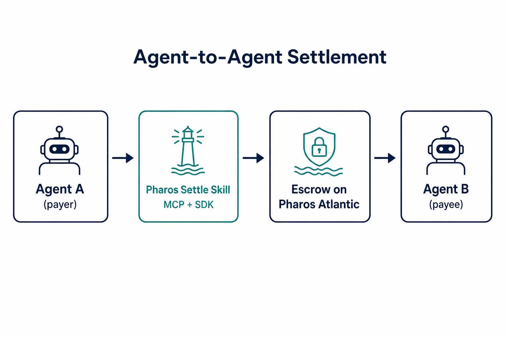

# Pharos Settle — Hackathon submission

## DoraHacks copy-paste

**Title:** Pharos Settle — Stripe Checkout for AI agents on Pharos  
**Tags:** AgentSkill, MCP, Payments, Onchain, Pharos  
**One-liner:** Dual-ghost protection + agent-native API (Skill + 17 MCP tools) for agent-to-agent work settlement on Pharos — payer-only funding, auditable reject, optional arbiter disputes, SALI FastPay batch payroll. Live Atlantic v1.3.0.

[](https://github.com/shery8595/Pharos-Settle) [](deployments/atlantic.json) [](JUDGES.md) [](docs/mcp/tools-table.md)

**Judges → start with [JUDGES.md](JUDGES.md)** · mock demo: `npm run demo:judge` (no keys)

---

## Why this is a Phase 1 winner

Pharos Settle is a **reusable Skill** for safe agent-to-agent payments on Pharos. It is not a demo-only script: it ships a portable Skill, **17 MCP tools**, TypeScript SDK, live Atlantic contracts, batch payroll, ghost protection, and judge-friendly mock demos.

> Generic escrow protects humans; Pharos Settle gives autonomous agents a reusable payment Skill with simulate-first execution, next-action polling, ghost recovery, and MCP/SDK parity.

| Label | What it means |
|-------|----------------|
| **Phase 1 shipped** | Contracts, SDK, MCP, Skill, Atlantic deploy, 147 tests, ghost demos |
| **Phase 2 roadmap only** | Marketplace, reputation, neutral arbitration — not in this repo yet |
| **Skill usable today** | Agents plug in via `SKILL.md` + MCP; `npm run demo:judge` proves it in <30s |

Plain scenario: [examples/agent-hires-agent.md](examples/agent-hires-agent.md) · MCP tools: [docs/mcp/tools-table.md](docs/mcp/tools-table.md)



---

**Stripe Checkout for AI agents on Pharos** · Agent-to-agent work settlement with **ghost protection**.

**Package:** `pharos-trusted-settlement` v1.3.0 · **Network:** Pharos Atlantic (`688689`) · **Tests:** 147 green

### What's novel

- **Dual-ghost protection** — payee ghosts → reclaim; payer ghosts → auto-release claim; junk delivery → reject
- **`nextAction` loops** — agents poll one hint instead of hardcoding flows
- **`preflightHash` audit log** — simulate checks hashed and stored on-chain (off-chain verifiable; contracts do not enforce)
- **Manifest handoff** — split payer/payee MCPs without mixing keys
- **SALI FastPay** — parallel batch agent payroll on Atlantic

See [docs/WHATS-NOVEL.md](docs/WHATS-NOVEL.md) · [docs/security/threat-model.md](docs/security/threat-model.md)

---

## Phase 1 shipped vs Phase 2 roadmap

| **Phase 1 shipped** (usable today) | **Phase 2 roadmap only** |
|-----------------------------------|--------------------------|
| Smart contracts (4 + TEST token) | Agent marketplace |
| TypeScript SDK | Reputation scores |
| MCP server — 17 tools | Neutral on-chain arbitration |
| Agent Skill module (`SKILL.md`) | |
| Live Atlantic deployment | |
| 147 tests (52 Hardhat + 95 Vitest) | |
| Cooperative junk review (`reject_delivery` safety valve) | |

Roadmap detail: [docs/PHASES.md](docs/PHASES.md)

---

## What it is (human terms)

One AI agent hires another. Money locks in escrow until work is proven. Then pay, timeout-pay, or refund.

**Ghost protection:**

| If… | Then… |
|-----|-------|
| Worker never delivers | Payer gets money back |
| Worker submits junk delivery | Payer **safety valve** during dispute window (`reject_delivery`, cooperative review) |
| Payer disappears after delivery | Worker still gets paid |
| Both cooperate | Instant settlement |

### Workflow parameters (swap these)

| Parameter | Field | Example |
|-----------|-------|---------|
| Payer | `agentA` | Funded Atlantic wallet |
| Payee | `agentB` | Worker address |
| Token | `token` | TEST / USDC / USDT / WBTC / WETH / WPHRS — [`atlantic.json`](deployments/atlantic.json) |
| Amount | `amount` (wei) | `1e18` = 1 TEST · `10e6` = 10 USDC |
| Task id | `workDescription` | `proposal-brief-12` |
| Network | `deploymentNetwork` | `atlantic` or your own deploy |
| Mode | `mode` | `cooperative` \| `safetyNet` |

| Plain English | Technical |
|---------------|-----------|
| Dry-run before paying | Preflight / `simulateTrustedSettlement` |
| Cursor / Claude plug-in | MCP (`npm run mcp`) — [17 tools](docs/mcp/tools-table.md) |
| Agent how-to file | Skill (`SKILL.md` + `assets/` + `references/`) |
| Pay after work proof | Hybrid release |
| Pay many workers at once | SALI FastPay (`saliFast` batch) |

---

## What judges get

| Layer | Deliverable |
|-------|-------------|
| On-chain | Router + escrow + registry + allowlist — [live addresses](deployments/atlantic.json) |
| SDK | `simulateTrustedSettlement` → `executeTrustedSettlement` + `nextAction` |
| MCP | 17 tools — payer/payee split + batch |
| Skill | `SKILL.md` + `assets/` + `references/` — composable agent economy primitive |

### Composability design

**Two layers:** ergonomic **Skill/MCP** for agents + **primitives** (`steps.ts`) for custom workflows. Same guarantees at both surfaces.

| Step | MCP tool | SDK ergonomic |
|------|----------|---------------|
| Preflight | `simulate_trusted_settlement` | `simulateTrustedSettlement` |
| Fund | `fund_deal` | `fundDealSettlement` |
| Deliver | `submit_delivery` | `submitDeliveryForDeal` |
| Status | `get_settlement_status` | `getSettlementStatus` |
| Attest | `attest_release` | `attestReleaseForDeal` |
| Claim | `complete_claim_for_deal` | `completeClaimForDeal` |
| Reclaim | `reclaim_trusted_settlement` | `reclaimTrustedSettlement` |
| Reject junk | `reject_delivery` | `rejectDeliveryForDeal` |

**Patterns:** (1) human-triggered payment · (2) payee recovery when payer ghosts · (3) reclaim when payee ghosts · (4) reject junk delivery · (5) SALI FastPay batch

**Guarantees:** `nextAction` loops · `dealId` handoff · `preflightHash` audit log · `reject_delivery` + `reasonHash` · optional arbiter + `resolve_dispute` · `resultHash` delivery · MCP/SDK parity

> **v1.3.0:** Payer-only funding; hybrid `disputeWindow < ttl` on-chain. Phase 1 = cooperative settlement + ghost protection; Phase 2 adds neutral arbitration.

See [SKILL.md](SKILL.md) · [JUDGES.md](JUDGES.md) · [examples/agent-hires-agent.md](examples/agent-hires-agent.md)

---

## Run it

### Mock first (no keys)

```bash
npm install
npm run demo:judge
```

### Live Atlantic (keys in `.env`)

```bash
cp .env.example .env   # PRIVATE_KEY + AGENT_B_PRIVATE_KEY
npm run demo:pharos    # → PharosScan link in output
```

See [JUDGES.md](JUDGES.md) for expected output snippets.

| Command | Shows |
|---------|--------|
| `npm run demo:ghost-payee:simulate` | Ghost payee — payer reclaims (mock, no keys) |
| `npm run demo:ghost-payer:simulate` | Ghost payer — payee paid when payer ghosts (mock) |
| `npm run demo:batch` | SALI FastPay — parallel batch payroll |
| `npm run demo:pharos` | Live cooperative settlement |
| `npm test` | 147 tests |

Full list: [docs/examples/demos.md](docs/examples/demos.md)

---

## Live deployment (Atlantic)

| Contract | Address |
|----------|---------|
| SettlementRouter | `0xb39f403f7f36a2a1f4c35a0808f3a024fb73452e` |
| DealEscrow | `0x2911c456bf766661572eb8ab92f8cfd656661a9b` |
| AgentRegistry | `0xe4991f5a54b35cfbcf952c31ec7dfcf432a8c173` |
| TokenAllowlist | `0x456848b1a38954a61ee7f34a997d468831f2d224` |
| TEST token | `0x008f64b4da7ffcafad2706585cae349bd59b48bf` |

Explorer: [atlantic.pharosscan.xyz](https://atlantic.pharosscan.xyz) · Proof: [`deployments/atlantic.json`](deployments/atlantic.json)

### Live proof (PharosScan)

Atlantic testnet txs from `npm run demo:*` (2026-06-17, v1.3.0 contracts).

| Flow | Tx hash | Notes |
|------|---------|-------|
| Cooperative settlement | [`0xfe8c7003…fc7e50`](https://atlantic.pharosscan.xyz/tx/0xfe8c7003ae37495a991b5c8ed158bfde6c20c660998b57ed66dda2d02cfc7e50) | `npm run demo:pharos` — claim tx |
| SALI batch | [`0xcf40b871…6cab6`](https://atlantic.pharosscan.xyz/tx/0xcf40b871128c5ec1381fcf29920bc8f57b0130dfc0b1df2588fa52a7fed6cab6) | `npm run demo:batch` — 5 parallel fund+claim; sample claim |
| Ghost payee reclaim | [`0x07a03b5f…deb0eb`](https://atlantic.pharosscan.xyz/tx/0x07a03b5f9b5a2097cafc4471bf39ce2f6e4e1fe236740cb5d863f5a6eadeb0eb) | `npm run demo:ghost-payee` — refund tx |
| Ghost payer claim | [`0x9d9df3c3…4c049`](https://atlantic.pharosscan.xyz/tx/0x9d9df3c38d99bbd147f6c602d3bd7c403895a7180103d77dc2db509fe7c4c049) | `npm run demo:ghost-payer` — payee claim after auto-release |

---

## Deeper docs

| Doc | Purpose |
|-----|---------|
| [JUDGES.md](JUDGES.md) | Judge quickstart (mock first) |
| [docs/PHASES.md](docs/PHASES.md) | Phase 1 vs Phase 2 |
| [docs/mcp/tools-table.md](docs/mcp/tools-table.md) | All 17 MCP tools at a glance |
| [examples/agent-hires-agent.md](examples/agent-hires-agent.md) | Plain-English agent scenario |
| [docs/README.md](docs/README.md) | Full handbook |
| [SKILL.md](SKILL.md) | Agent Skill |
