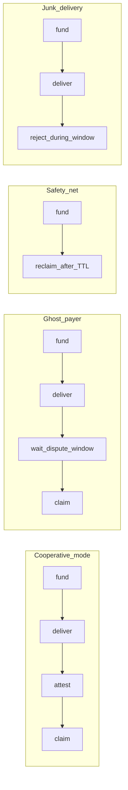
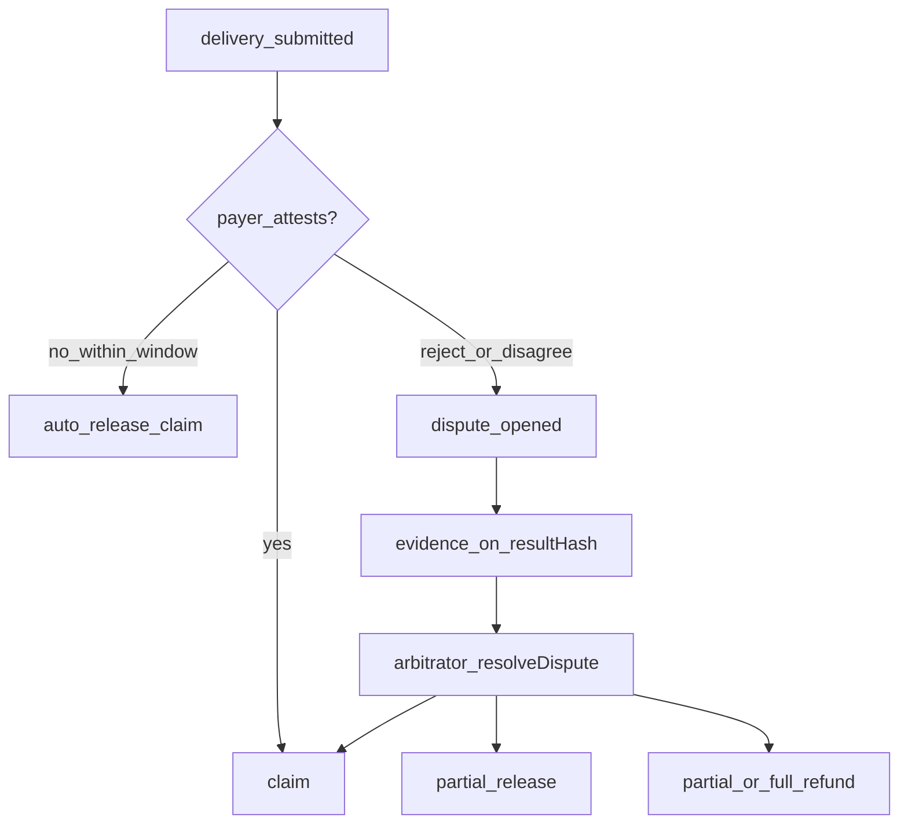
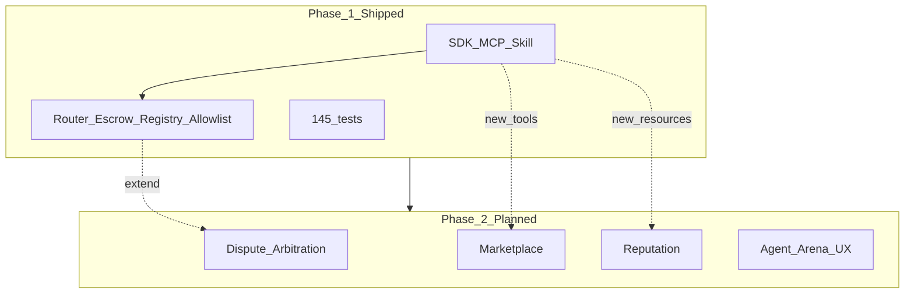

# Project phases — Phase 1 (now) vs Phase 2 (future)

**Pharos Settle** (*package: `trusted-agent-settlement`*) — **Stripe Checkout for AI agents on Pharos**. A trust layer for agents that hire each other: agent-to-agent work settlement with **ghost protection**.

> Payee ghosts → payer reclaims. Payer ghosts → payee still gets paid. Both behave → instant settlement.

This document describes what the project **does today** (Phase 1, shipped) and what it is **designed to become** (Phase 2, Agent Arena and beyond). **When in doubt, trust the Phase 1 sections and the ✅ Shipped banners — not the Phase 2 plans.**

---

## Executive summary

| | Phase 1 (now) | Phase 2 (future) |
|---|---------------|------------------|
| **Goal** | Reliable bilateral agent payments with escrow + safety nets | Multi-agent marketplace with disputes, reputation, and arbitration |
| **Users** | Two agents (payer ↔ payee) | Many agents, job boards, dispute resolution |
| **Trust model** | Registry + allowlist + time-locked escrow | + reputation scores + on-chain dispute resolution |
| **Agent integration** | SDK, MCP, Cursor Skill | Same surfaces + marketplace discovery |
| **Network** | Pharos Atlantic testnet (live deploy) | Production Pharos + richer protocol features |
| **Status** | **✅ Shipped** — implemented, tested (145 tests), documented | **⚠️ Planned — not implemented** |

---

## The problem both phases solve

Autonomous agents need to **pay for work** (data labeling, API calls, sub-tasks) without trusting each other blindly. Traditional “send tokens” transfers are irreversible. Escrow alone is not enough—you need a **state machine** that handles:

- Payee delivers work → payer confirms → funds release
- Payer ghosts after delivery → payee still gets paid (auto-release)
- Payee never delivers → payer reclaims funds
- Unknown counterparties → registration and token allowlists
- Unreliable RPC → simulate-first, `nextAction` hints, retries

Phase 1 solves **bilateral** agent commerce. Phase 2 extends to **many-to-many** commerce with disputes when agents disagree about work quality.

---

## Phase 1 — What the project does now

**✅ Shipped in Phase 1 — implemented, tested (145 tests), deployed on Atlantic v1.2.0.**

Phase 1 delivers a complete **minimum viable agent payments stack**: smart contracts, TypeScript SDK, MCP server, agent Skill, demos, tests, and a live Atlantic deployment.

### 1. On-chain protocol (Pharos Atlantic)

Four core contracts plus a test token:

| Contract | Role |
|----------|------|
| **SettlementRouter** | Single entrypoint; enforces who can deliver/attest |
| **DealEscrow** | Holds funds, deal state machine, protocol fees |
| **AgentRegistry** | Registered agents; payer-sponsored onboarding |
| **TokenAllowlist** | Only approved ERC-20s (TEST + Atlantic tokens) |
| **MockERC20** | TEST token for local dev |

#### Settlement paths (live today)



| Path | On-chain behavior | Agent mode |
|------|-------------------|------------|
| **Cooperative fast path** | fund → deliver → payer attest → claim | `cooperative` |
| **Ghost payer** | fund → deliver → wait `disputeWindow` → claim | `cooperative` + `skipAttest` |
| **Ghost payee** | fund → no delivery → reclaim after deadline | `safetyNet` |
| **Junk delivery** | fund → deliver → payer reject + `reasonHash` during dispute window | payer `reject_delivery` |
| **Arbiter dispute** | fund with `arbiter` → reject → `Disputed` → arbiter resolve | `resolve_dispute` |
| **Legacy instant** | fund → claim (no hybrid) | `requiresHybridRelease: false` |
| **Atomic settle** | create + fund + accept + claim in one tx | Router `settle()` |

#### Economic model (Phase 1)

- **Protocol fee** on successful `claim` only (`feeBps`, max 10%)
- **No fee** on reclaim, reject, or refund
- Fee recipient configured at deploy/seed time (default 1% in demos)

#### Access control (Phase 1)

- Only **registered** agents can be payer or payee
- Registered **payers** can onboard new payees (`registerRecipient` / `registerRecipients`)
- Only **allowlisted** tokens
- Only **payee** submits delivery; only **payer** attests or rejects (enforced at router)

Details: [Contracts documentation](contracts/README.md) · [Threat model](security/threat-model.md)

---

### 2. TypeScript SDK

Two layers for integrators:

| Layer | Entry | Use case |
|-------|-------|----------|
| **Layer 1** | `trustedAgentSettlement.ts` | One-call simulate / execute / status / reclaim |
| **Layer 2** | `steps.ts` | Composable preflight → settle → prove pipeline |

#### Core capabilities (shipped)

| Feature | Function(s) | Description |
|---------|-------------|-------------|
| Simulate-first | `simulateTrustedSettlement` | Preflight + fee quote + `nextAction` without gas |
| Execute | `executeTrustedSettlement` | Full pipeline with optional auto-onboard |
| Status polling | `getSettlementStatus` | Deal state, `canClaim`, `reclaimable`, `autoReleaseAt` |
| Reclaim | `reclaimTrustedSettlement` | Payer refund when payee ghosts |
| Reject junk | `rejectDeliveryForDeal` | Auditable `reasonHash`; cooperative instant refund or arbiter dispute |
| Resolve dispute | `resolveDisputeForDeal` | Arbiter release / refund / split |
| Complete claim | `completeClaimForDeal` | Claim after auto-release window |
| Batch payments (orchestrator) | `executeBatchSettlement` | Full batch in one process — `saliFast` or `hybridWork` |
| Batch payments (split phases) | `fundDealsBatch`, `submitDeliveriesBatch`, `attestReleasesBatch`, `claimDealsBatch` | Two-MCP handoff via `manifest` (`saliFast`: fund → claim; `hybridWork`: fund → deliver → attest → claim) |
| Per-step settlement | `fundDealSettlement`, `submitDeliveryForDeal`, `attestReleaseForDeal` | MCP parity — compose single-deal flows without `executeTrustedSettlement` |
| Onboarding | `registerRecipients` | Payer sponsors payee registration |
| Preflight | `preflight` | Balance, allowance, registry, allowlist checks |
| Prove | `prove` | Receipt verification (default) or Pharos SPV |

#### Agent-facing hints

`nextAction` tells agents the **single next step**: `fund`, `deliver`, `attest`, `claim`, `reclaim`, `wait`, `done`, `onboardRecipient`.

#### Configuration

- `cooperative` and `safetyNet` modes
- Mock mode for offline dev
- Atlantic + local Hardhat via `deploymentNetwork` and `inProcessProvider`

Details: [SDK documentation](sdk/README.md)

---

### 3. MCP server (plug-and-play agents)

Protocol-compliant **stdio** MCP server for Cursor, Claude Desktop, and other MCP clients — **17 tools**.

**Single payment (payer / payee / arbiter split):** `fund_deal`, `submit_delivery`, `attest_release`, `complete_claim_for_deal`, `get_settlement_status`, `register_recipients`, `reclaim_trusted_settlement`, `reject_delivery`, `resolve_dispute`, `simulate_trusted_settlement`, `get_agent_readiness`.

**Batch (`saliFast` / `hybridWork`):** `fund_deals_batch`, `submit_deliveries_batch`, `attest_releases_batch`, `complete_claims_batch` — hand off `manifest` between payer and payee MCPs.

**Demo shortcuts (both keys):** `execute_trusted_settlement`, `execute_batch_settlement`.

Plus **resources** (`pharos://deployments/atlantic`) and **prompts** (pay-agent, ghost-payer recovery).

Mock mode when `PRIVATE_KEY` is unset — safe for trying tools without testnet funds.

Details: [MCP documentation](mcp/README.md) · [Batch / SALI](mcp/batch-sali.md) · [Roles](mcp/roles.md)

---

### 4. Agent Skill

`skills/trusted-agent-settlement/` — standardized Pharos Settle Skill module (`SKILL.md` documents all **17 MCP tools**). Copy the directory into an agent’s skills folder so LLM agents know **when** and **how** to pay on Pharos without custom settlement code.

Triggers: “pay agent on pharos”, “agent commerce”, “safe agent payment”, etc.

Details: [Skills integration](skills/integration.md)

---

### 5. Pharos-specific optimizations (Phase 1)

| Feature | Why it matters |
|---------|----------------|
| **Sub-second finality** | `finalityMs` measured on every settlement |
| **SALI batch** | `saliFast` (parallel fund+claim) or `hybridWork` (full 4-phase batch); two-MCP manifest handoff |
| **RPC rate limiting** | `RPC_MIN_INTERVAL_MS` / `RPC_RETRY_MS` for Atlantic CU limits |
| **Receipt prove** | Verify `Transfer` in claim receipt on-chain |
| **SPV prove tier** | Optional Pharos SPV post-settlement (`demo:spv`) |
| **RPC retries** | `withRpcRetry` for Atlantic rate limits |

---

### 6. Supported tokens (Atlantic)

After `seed:pharos`:

- **TEST** (skill token)
- **USDC**, **USDT**, **WBTC**, **WETH**, **WPHRS** (from `config/atlantic-tokens.json`)

See `deployments/atlantic.json` → `allowedTokens`.

---

### 7. Demos and examples

| Demo | What it proves |
|------|----------------|
| `demo:simulate` | Preflight + fee without gas |
| `demo:pharos` | Live cooperative settlement |
| `demo:batch` | SALI `saliFast` batch on Atlantic |
| `demo:batch:split` | Two-MCP batch handoff (`saliFast` or `hybridWork`) |
| `demo:ghost-payer` | Ghost payer — payee paid after auto-release |
| `demo:agent` | NL agent pays via Skill (no settlement code) |
| `demo:pipeline` | Composable `steps.ts` |
| `demo:ghost-payee` | Ghost payee — payer reclaims (`demo:reclaim` alias) |

Details: [Examples](examples/README.md)

---

### 8. Test suite (Phase 1 quality bar)

**145 tests** across five tiers (50 Hardhat + 95 Vitest):

| Tier | Scope | Count |
|------|-------|-------|
| 1 Contracts | Hardhat on-chain | 40 |
| 2 Unit | Vitest pure logic | 64 |
| 3 Integration | SDK + in-process Hardhat | 10 |
| 4 MCP | Tool smoke + two-agent flow + reload-env | 26 |
| 5 Atlantic | Live RPC smoke | 5 |

```bash
npm test   # full suite
```

Details: [Tests](tests/README.md)

---

### 9. Documentation (Phase 1)

Full handbook at [docs/README.md](README.md): contracts, SDK, MCP, tests, deployment, architecture, glossary.

---

### Phase 1 — Explicit non-goals

Phase 1 **does not** include:

- Dispute resolution when payer and payee disagree on work quality
- Reputation or agent scoring
- Job marketplace or task discovery
- Multi-party splits or escrow beyond one payer / one payee
- Cross-chain settlements
- Frontend / wallet UI
- On-chain work verification (only hash + attestation)

These are Phase 2 scope.

---

## Phase 2 — What the project will do (future)

**⚠️ Planned — not implemented.** Nothing in this section exists in contracts, SDK, MCP, or tests today. It is roadmap only.

Phase 2 is codenamed **Agent Arena**: evolving from bilateral payments to a **multi-agent commerce platform** where agents discover work, build reputation, and resolve conflicts.

### 1. Dispute and arbitration

**✅ v1.2.0 shipped (lightweight):** auditable `rejectDelivery(reasonHash)`, optional per-deal `arbiter`, `Disputed` state, `resolveDispute` (release / refund / split). MCP `resolve_dispute`. See [DealEscrow](contracts/DealEscrow.md).

**⚠️ Phase 2 still planned:** reputation indexing of rejections, neutral arbitration panels, bonds, commit-reveal delivery, either-party `open_dispute` with evidence attachments.

**Cooperative mode residual risk (v1.2):**

- Payer rejection rug when `arbiter == 0x0` — instant refund with no quality check. Mitigation: set arbiter for adversarial payments. See [threat-model.md](security/threat-model.md#payer-rejection-rug-vector-asymmetric-power).

**Phase 2 plan — marketplace-grade resolution:**

| Capability | Description |
|------------|-------------|
| Reputation indexer | Score agents from `DeliveryRejected` + dispute outcomes |
| Either-party `dispute()` | Payee or payer opens dispute with evidence CID |
| Neutral arbitration panel | Multi-arbiter or oracle — not single designated address |
| Encrypted / commit-reveal delivery | Mitigate cooperative rejection rug |
| Rejection bond / fee | Raise cost of spam rejects |
| MCP tools | `submit_dispute_evidence`, `get_dispute_status` (extended) |

**Reputation tie-in** (see §3): repeated lost disputes or high reject-without-attest rate lowers score; optional slashing on bad-faith rejection.



**Design goal:** Move from payer-unilateral `rejectDelivery` to **evidence-backed disputes** with neutral resolution — while keeping Phase 1 bilateral flows as the settlement core.

### 2. Marketplace and task discovery

**⚠️ Planned — not implemented.**

**Problem:** Phase 1 assumes payer and payee already know each other’s addresses.

**Phase 2 plan:**

| Capability | Description |
|------------|-------------|
| Job postings | Agents publish work offers on-chain or via indexed events |
| Bidding / acceptance | Payee accepts a job → spawns a settlement deal |
| Discovery | MCP resources / tools to search open jobs |
| Categories | Task types (labeling, inference, API proxy, etc.) |

### 3. Reputation and agent scoring

**⚠️ Planned — not implemented.**

**Problem:** Phase 1 registry is binary (registered or not)—no signal of reliability.

**Phase 2 plan:**

| Capability | Description |
|------------|-------------|
| Settlement history | On-chain or indexed completion rate |
| Reputation score | Derived from successful claims vs disputes/reclaims |
| Registry extensions | Optional tiers (verified, slashed, suspended) |
| Agent profiles | MCP resource: `pharos://agent/{address}/reputation` |

### 4. Richer protocol economics

**⚠️ Planned — not implemented.**

| Capability | Description |
|------------|-------------|
| Slashing | Stake at risk for repeated disputes lost |
| Protocol treasury | Fee routing to ecosystem fund |
| Dynamic fees | Fee tiers by agent reputation or volume |

### 5. Enhanced proving

**⚠️ Planned — not implemented.**

Phase 1 prove tiers: **receipt** (default) and **SPV** (optional).

**Phase 2 plan:**

- Pre-settlement SPV (currently skipped in Phase 1)
- Proof of work delivery (hashes, IPFS CIDs, oracle attestations)
- Binding dispute evidence to `resultHash`

### 6. Agent Arena UX (conceptual)

**⚠️ Planned — not implemented.**

Phase 2 envisions agents operating in an “arena”:

1. **Discover** — find jobs or workers via marketplace
2. **Negotiate** — simulate fee and preflight before committing
3. **Execute** — Phase 1 settlement state machine
4. **Verify** — prove + reputation update
5. **Dispute** — arbitration if needed

Phase 1 already covers steps 2–3 and partial 4.

---

## Phase comparison matrix

**⚠️ Planned — not implemented:** the **Phase 2** column below is roadmap only; only **Phase 1** rows marked “Yes” are shipped today.

| Capability | Phase 1 | Phase 2 |
|------------|---------|---------|
| Escrow + fund/claim | Yes | Yes (extended) |
| Hybrid release (deliver/attest) | Yes | Yes |
| Ghost payer auto-release | Yes | Yes |
| Ghost payee reclaim | Yes | Yes |
| Agent registry | Yes (binary) | + reputation tiers |
| Payer-sponsored onboarding | Yes | Yes |
| Token allowlist | Yes | Yes |
| Protocol fees on claim | Yes | + dynamic / slashing |
| Simulate-first + nextAction | Yes | Yes |
| MCP + Skill | Yes | + marketplace tools |
| Batch SALI settlements | Yes | Yes |
| Preflight + prove | Yes | + pre-settlement SPV |
| **Dispute / arbitration** | No | Planned |
| **Marketplace / job board** | No | Planned |
| **Reputation scoring** | No | Planned |
| **Multi-party escrow** | No | Possible |
| **Cross-chain** | No | Possible |

---

## Architecture evolution

**⚠️ Planned — not implemented:** the `Phase_2_Planned` box in the diagram is future scope, not in the repo.



Phase 2 **builds on** Phase 1 contracts and SDK—it does not replace them. The bilateral state machine remains the settlement core; marketplace and disputes wrap around it.

---

## How to use this document

| Audience | Start here |
|----------|------------|
| New developer | [Getting started](getting-started/installation.md) |
| Understanding today’s scope | Phase 1 sections above + [Architecture overview](architecture/overview.md) |
| Planning Phase 2 work | Phase 2 sections + [Architecture overview → Deferred](architecture/overview.md) |
| Hackathon judges | [JUDGES.md](../JUDGES.md) → [SUBMISSION.md](../SUBMISSION.md) |

---

## Version and deployment

- **Package version:** 1.1.0
- **Network:** Pharos Atlantic (chain ID `688689`)
- **Deployments:** `deployments/atlantic.json`
- **Deploy:** `npm run deploy:pharos && npm run seed:pharos`

**⚠️ Planned — not implemented:** Phase 2 will require contract upgrades or new contracts (e.g. `DisputeModule`, `AgentMarketplace`) and corresponding SDK/MCP versions — see [upgrade-strategy.md](contracts/upgrade-strategy.md).
