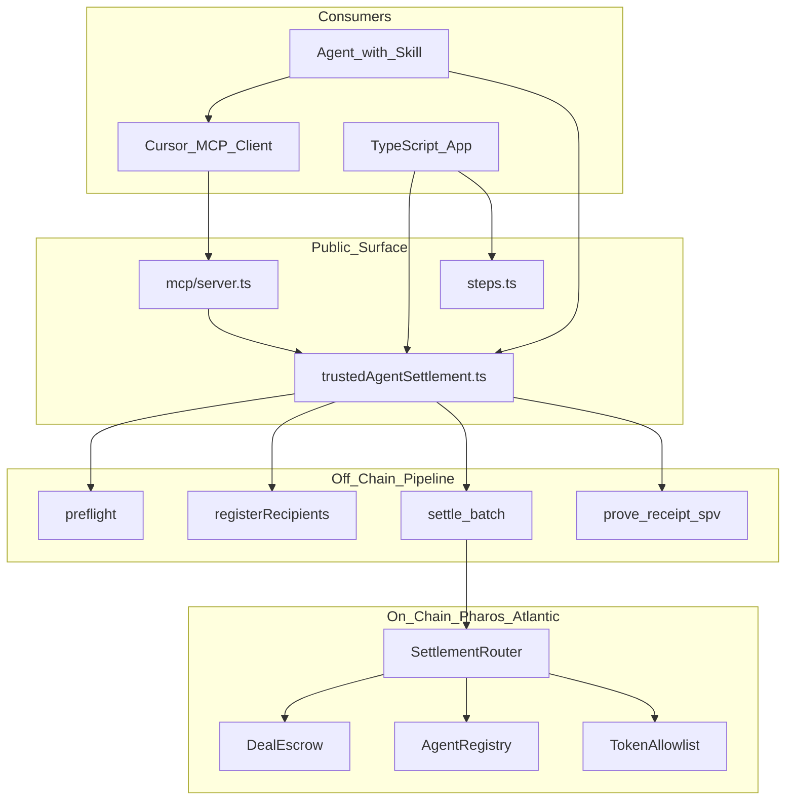

# Pharos Settle — Documentation

**Stripe Checkout for AI agents on Pharos** — a trust layer for agents that hire each other.

**Pharos Settle** (*package: `trusted-agent-settlement`*) is an **agent economy primitive**: agent-to-agent work settlement with **ghost protection**, simulate-first flows, SALI FastPay batch payroll, and 17 MCP tools.

> Payee ghosts → payer reclaims. Payer ghosts → payee still gets paid. Both behave → instant settlement.

## I want to…

| Goal | Start here |
|------|------------|
| Install and run locally | [Getting started → Installation](getting-started/installation.md) |
| Deploy and demo on Atlantic testnet | [Getting started → Atlantic quickstart](getting-started/quickstart-atlantic.md) |
| Understand the state machine | [Architecture → Overview](architecture/overview.md) |
| Read smart contract APIs | [Contracts](contracts/README.md) |
| Integrate the TypeScript SDK | [SDK](sdk/README.md) |
| Plug into Cursor / Claude via MCP | [MCP → Setup](mcp/setup.md) · [Other IDEs](mcp/other-ides.md) |
| Agent instructions (all IDEs) | [AGENTS.md](../AGENTS.md) |
| Run or extend the test suite | [Tests](tests/README.md) |
| Deploy contracts | [Deployment](deployment/README.md) |
| Run example demos | [Examples](examples/README.md) |
| Install as an agent Skill | [Skills → Integration](skills/integration.md) (`SKILL.md` + `assets/` + `references/`, cast-first) |
| Understand Phase 1 vs Phase 2 roadmap | [Phase 1 vs Phase 2](PHASES.md) |

## System map

## Full table of contents

### Getting started
- [Installation](getting-started/installation.md)
- [Local quickstart](getting-started/quickstart-local.md)
- [Atlantic quickstart](getting-started/quickstart-atlantic.md)
- [Environment variables](getting-started/environment.md)

### Architecture
- [Overview](architecture/overview.md)
- [On-chain flows](architecture/on-chain-flows.md)
- [Off-chain pipeline](architecture/off-chain-pipeline.md)
- [Data model](architecture/data-model.md)

### Contracts
- [Contracts index](contracts/README.md)
- [SettlementRouter](contracts/SettlementRouter.md)
- [DealEscrow](contracts/DealEscrow.md)
- [AgentRegistry](contracts/AgentRegistry.md)
- [TokenAllowlist](contracts/TokenAllowlist.md)
- [MockERC20](contracts/MockERC20.md)

### SDK
- [SDK index](sdk/README.md)
- [API reference](sdk/api-reference.md)
- [Configuration](sdk/configuration.md)
- [Settlement flows](sdk/settlement-flows.md)
- [Preflight and onboarding](sdk/preflight-and-onboarding.md)
- [Prove tiers](sdk/prove-tiers.md)
- [Batch settlements](sdk/batch-settlements.md)

### MCP
- [MCP index](mcp/README.md)
- [Setup](mcp/setup.md)
- [Roles (payer / payee)](mcp/roles.md)
- [SALI FastPay](mcp/batch-sali.md)
- [Tools](mcp/tools.md)
- [Resources and prompts](mcp/resources-and-prompts.md)
- [MCP architecture](mcp/architecture.md)

### Tests
- [Test suite overview](tests/README.md)
- [Tier 1: Contracts](tests/tier-contracts.md)
- [Tier 2: Unit](tests/tier-unit.md)
- [Tier 3: Integration](tests/tier-integration.md)
- [Tier 4: MCP](tests/tier-mcp.md)
- [Tier 5: Atlantic smoke](tests/tier-atlantic.md)
- [Troubleshooting](tests/troubleshooting.md)

### Deployment
- [Deployment index](deployment/README.md)
- [Atlantic](deployment/atlantic.md)
- [Local Hardhat](deployment/local-hardhat.md)
- [Scripts](deployment/scripts.md)

### Examples
- [Examples index](examples/README.md)
- [Demos](examples/demos.md)
- [Batch pipeline](examples/batch-pipeline.md)
- [Ghost payer](examples/ghost-payer.md)
- [Agent consumer](examples/agent-consumer.md)

### Roadmap
- [Phase 1 vs Phase 2](PHASES.md) — what ships now vs Agent Arena (future)

### Other
- [Glossary](glossary.md)
- [Judge quickstart](../JUDGES.md)
- [Hackathon submission](SUBMISSION.md)
- [Demo video script](demo-script.md)
