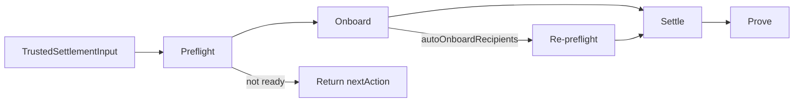

# Off-chain pipeline

The SDK orchestrates four stages. Each stage is independently callable via `steps.ts`.

## 1. Preflight

**Module:** `src/internal/preflight/index.ts`

Read-only checks before gas:

| Check | Name |
|-------|------|
| Payer registered | `payer_registered` |
| Payee registered | `payee_registered` |
| Token allowed | `token_allowed` |
| Payer balance | `payer_balance` |
| Payer allowance to escrow | `payer_allowance` |

Produces `preflightHash` (deterministic from input + checks) stored on-chain.

## 2. Onboard (optional)

**Module:** `src/internal/onboard/recipients.ts`

When `autoOnboardRecipients: true` and only payee registration fails:

- Payer calls `registerRecipient` or `registerRecipients` on `AgentRegistry`
- Preflight re-run before settle

## 3. Settle

**Module:** `src/internal/settle/index.ts`

| Step | On-chain call | Signer |
|------|---------------|--------|
| Fund | `fundAndAccept` or `fundAndAcceptHybrid` | Payer |
| Deliver | `submitDelivery` | Payee |
| Attest | `attestRelease` | Payer |
| Claim | `claim` | Payee |

`skipAttest: true` omits attest; returns early if not yet claimable.

## 4. Prove

**Module:** `src/internal/prove/index.ts`

Default tier `receipt`: verify ERC-20 `Transfer` from escrow to payee in claim receipt.

Optional tier `spv`: Pharos SPV post-settlement verification.

## Transport

All RPC calls use `transportFromConfig` (`src/shared/clients.ts`):

- **Atlantic:** `http(PHAROS_RPC_URL)`
- **Hardhat tests:** `inProcessProvider` (custom transport)

Prove step must use the same transport as settle — see [Test troubleshooting](../tests/troubleshooting.md).

## Related docs

- [Preflight and onboarding](../sdk/preflight-and-onboarding.md)
- [Prove tiers](../sdk/prove-tiers.md)
- [Configuration](../sdk/configuration.md)
