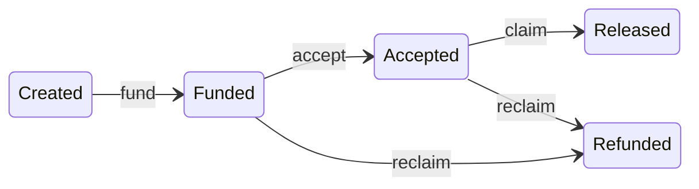

# On-chain flows

## Deal lifecycle

## Flow variants

### Atomic settle (legacy one-tx)

`SettlementRouter.settle()` — create, fund, accept, claim in one transaction. Non-hybrid (`requiresHybridRelease: false`). Used for demos of instant settlement.

### Legacy fund → claim

`fundAndAccept` (non-hybrid) → payee calls `claim` immediately. SDK path when `requiresHybridRelease: false`.

### Hybrid cooperative

`fundAndAcceptHybrid` with `requiresHybridRelease: true`:

1. Payer funds (via router)
2. Payee `submitDelivery(resultHash)`
3. Payer `attestRelease(resultHash)` — fast path
4. Payee `claim(proofHash)`

### Ghost payer (auto-release)

1. Fund + deliver (payer skips attest)
2. Wait until `block.timestamp >= deliverySubmittedAt + disputeWindow`
3. Payee `claim`

`canClaim` returns true when dispute window elapses after delivery.

### Ghost payee (reclaim)

1. Fund only (no delivery)
2. Wait until `block.timestamp > deadline`
3. Payer `reclaim` — full refund, no fee

Blocked if `deliverySubmittedAt > 0`.

## Fee rules

| Action | Fee |
|--------|-----|
| `claim` | `feeBps` of deal amount to `feeRecipient` |
| `reclaim` | None |
| `refund` path | None |

`MAX_FEE_BPS = 1000` (10%). Set via `DealEscrow.setFeeConfig`.

## Access control summary

| Function | Caller |
|----------|--------|
| `submitDelivery` | Payee only (enforced at router) |
| `attestRelease` | Payer only (enforced at router) |
| `claim` | Anyone (router delegates to escrow) |
| `reclaim` | Anyone (router delegates to escrow) |
| `fund`, `accept`, `createDeal` | Router only (escrow) |

## Registry and allowlist gates

Every fund path checks:

- `registry.requireRegistered(payer)` and `requireRegistered(payee)`
- `allowlist.requireAllowed(token)`

## Related docs

- [DealEscrow](../contracts/DealEscrow.md)
- [Settlement flows (SDK)](../sdk/settlement-flows.md)
- [Tier 1 contract tests](../tests/tier-contracts.md)
