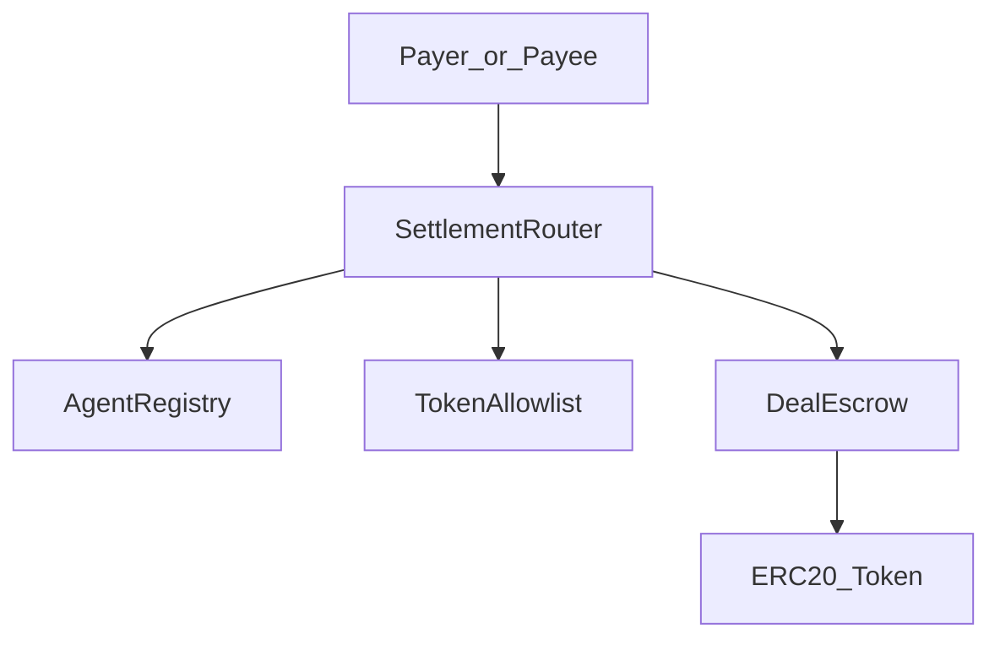

# Smart contracts

Solidity `0.8.20` with OpenZeppelin (`SafeERC20`, `ReentrancyGuard`). Optimizer enabled, `viaIR: true`.

**Why four contracts?** Deliberate separation of concerns: **SettlementRouter** enforces access, **DealEscrow** owns state and funds, **AgentRegistry** separates identity from payment logic, **TokenAllowlist** keeps the attack surface minimal. See [architecture overview](../architecture/overview.md#on-chain-contracts).

## Stack diagram

## Deployment order

1. `MockERC20` (local) or use existing Atlantic tokens
2. `AgentRegistry`
3. `TokenAllowlist`
4. `DealEscrow`
5. `SettlementRouter(registry, allowlist, escrow)`
6. `DealEscrow.setRouter(router)`
7. Seed: register agents, allow tokens, `setFeeConfig`

## Contract index

| Contract | File | Role |
|----------|------|------|
| [SettlementRouter](SettlementRouter.md) | `contracts/SettlementRouter.sol` | Public entrypoint |
| [DealEscrow](DealEscrow.md) | `contracts/DealEscrow.sol` | Escrow + state machine |
| [AgentRegistry](AgentRegistry.md) | `contracts/AgentRegistry.sol` | Agent allowlist |
| [TokenAllowlist](TokenAllowlist.md) | `contracts/TokenAllowlist.sol` | Token allowlist |
| [MockERC20](MockERC20.md) | `contracts/MockERC20.sol` | Test token (local) |

## Trust model

- **Owner** (deployer) manages registry, allowlist, fee config, router wiring.
- **Router** is the only caller that can mutate escrow deal state.
- **Payer/payee** interact via router for delivery and attestation (caller checks on router).

## Related tests

- [Tier 1: Contract tests](../tests/tier-contracts.md)
- [Deployment](../deployment/README.md)
