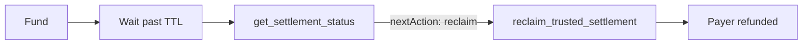

# Ghost payee example

**File:** `examples/ghost-payee/run-ghost-payee.ts`

Demonstrates payer getting funds back when the payee ghosts (never delivers).

## Flow

1. Payer funds hybrid deal (`fundDealSettlement` / `fund_deal`)
2. Payee **never** submits delivery
3. Wait past `ttlSeconds` (deal deadline)
4. Poll `get_settlement_status` until `nextAction: reclaim`
5. Payer calls `reclaimTrustedSettlement` (`mode: safetyNet` / `reclaim_trusted_settlement`)



## Run

```bash
npm run demo:ghost-payee
npm run demo:ghost-payee:simulate   # no keys, <5s

# Legacy alias
npm run demo:reclaim
```

Live Atlantic uses `DEMO_TTL_SECONDS` (default **120**) — shorten for quick tests: `DEMO_TTL_SECONDS=60 npm run demo:ghost-payee`.

## SDK pattern

```typescript
const funded = await fundDealSettlement(input, config);
// payee never delivers — wait past ttlSeconds

let status = await getSettlementStatus(funded.dealId!);
while (status.nextAction !== "reclaim") {
  await sleep(5000);
  status = await getSettlementStatus(funded.dealId!);
}

await reclaimTrustedSettlement(funded.dealId!, config);
```

## MCP prompt

Use `recover-from-ghost-payee` prompt — see [Resources and prompts](../mcp/resources-and-prompts.md).

Tool chain: `get_settlement_status` → wait until `reclaim` → `reclaim_trusted_settlement`.

## Related docs

- [Ghost payer](ghost-payer.md) — opposite safety net (payer ghosts)
- [What's novel](../WHATS-NOVEL.md) — dual-ghost protection
- [Settlement flows](../sdk/settlement-flows.md)
- [On-chain flows](../architecture/on-chain-flows.md)
