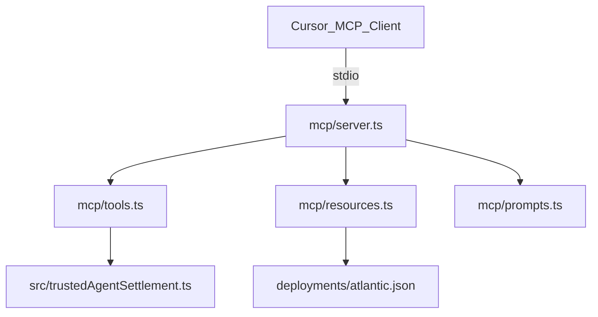

# MCP architecture

## Entry point

`mcp/server.ts`:

1. Loads `.env` via `mcp/reload-env.ts` (re-read on every tool call so key edits apply without restart)
2. Creates `McpServer` (name: `trusted-agent-settlement`, v1.1.1)
3. Registers tools, resources, prompts
4. Connects `StdioServerTransport`

## Tools layer

`mcp/tools.ts` — **16 tools**:

- Single payment: payer/payee split (`fund_deal`, `submit_delivery`, …)
- Batch: `fund_deals_batch`, `submit_deliveries_batch`, `attest_releases_batch`, `complete_claims_batch` (`saliFast` / `hybridWork`)
- Demo shortcuts: `execute_trusted_settlement`, `execute_batch_settlement`

Implementation details:

- Zod v4 schemas for tool inputs
- `buildConfig(mode, mock)` — mock when no `PRIVATE_KEY`
- Role-aware readiness via `get_agent_readiness`
- `pickInput(args)` → `TrustedSettlementInput`
- `formatResult` / `formatError` — JSON text responses

Delegates to SDK — no duplicate business logic. See [roles.md](roles.md) and [batch-sali.md](batch-sali.md).

## Resources layer

`mcp/resources.ts`:

- Reads `deployments/atlantic.json` from disk
- Serves static quickstart markdown

## Prompts layer

`mcp/prompts.ts`:

- Template messages for common agent workflows
- No on-chain side effects

## HTTP bridge (legacy)

`mcp/http.ts` — REST wrapper for tool discovery. Not required for Cursor stdio integration.

## Related tests

`test/mcp/tools.vitest.ts` — smoke all 5 tools with mock config.

## Related docs

- [Setup](setup.md)
- [Tools](tools.md)
