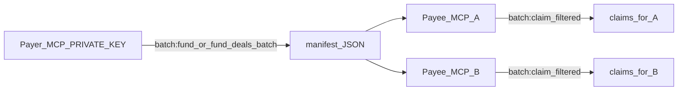

# SALI FastPay — batch agent payroll

**SALI FastPay** is Pharos Settle's Pharos-native superpower: **one payer, many worker agents, parallel settlement** using Atlantic's SALI parallel execution.

Also called **batch agent payroll** — fund N deals and claim N deals in the same block window.

## Modes

| Mode | Brand | Flow | Best for |
|------|-------|------|----------|
| `saliFast` | **SALI FastPay** | fund N → claim N | Microtask payroll, pre-trusted work, max throughput |
| `hybridWork` | **Batch agent commerce** | fund → deliver → attest → claim × N | On-chain work proof at scale |

Single-payment tools (`fund_deal`, `submit_delivery`, etc.) are unchanged and remain the primary Skill path.

## Example: 100 labeling microtasks

A **labeling coordinator** pays 100 worker agents after batch annotation:

```bash
BATCH_SIZE=100 npm run demo:batch    # SALI FastPay on Atlantic
```

Output includes `maxParallelInBlock` and `endToEndDealsPerSec` — proof of parallel settlement.

## Production split (batch = manifest, MCP = single identity)

> **Batch = coordination (manifest). MCP = single identity. Never mix keys in one env.**



| Tool / CLI | Role | Keys |
|------------|------|------|
| `fund_deals_batch` / `npm run batch:fund` | Lock escrow for N payees | `PRIVATE_KEY` only |
| `complete_claims_batch` / `npm run batch:claim` | Claim filtered manifest rows | `AGENT_B_PRIVATE_KEY` only (one payee per MCP) |
| `execute_batch_settlement` / `npm run pay:batch` | Demo shortcut | Both keys |

## Two-MCP split batch

### SALI FastPay (`saliFast`)

1. **Payer MCP:** `fund_deals_batch` with `batchMode: "saliFast"`
2. **Handoff:** share `manifest` from response
3. **Payee MCP:** `complete_claims_batch` with claims (`dealId`, `fundTx`, `amount`, `agentB`)

### Batch agent commerce (`hybridWork`)

1. **Payer MCP:** `fund_deals_batch` with `batchMode: "hybridWork"`
2. **Payee MCP:** `submit_deliveries_batch`
3. **Payer MCP:** `attest_releases_batch`
4. **Payee MCP:** `complete_claims_batch`

## Demo shortcut

One MCP with both keys: `execute_batch_settlement` with `batchMode` `saliFast` or `hybridWork`. CLI equivalent: `npm run pay:batch` (prints demo banner).

## CLI

**Production (split — tier 2 npm or tier 3 MCP):**

```bash
# Payer only — writes manifest
npm run batch:fund -- --payees 0xA,0xB,0xC --amount 1 --work-prefix "label-batch"
npm run batch:fund -- --jobs-file ./jobs.json --out ./manifest.json

# Payee only — filters manifest to AGENT_B_PRIVATE_KEY address
npm run batch:claim -- --manifest ./manifest.json
```

**Demo (both keys in one process):**

```bash
npm run pay:batch -- --payees 0xA,0xB,0xC --amount 1 --work-prefix "label-batch"
npm run pay:batch -- --payee 0x... --count 10 --amount 2 --mode saliFast
```

**Fixed demos:**

```bash
npm run demo:batch              # SALI FastPay, BATCH_SIZE=5
BATCH_SIZE=100 npm run demo:batch
BATCH_MODE=hybridWork npm run demo:batch
npm run demo:batch:split        # two-MCP payer/payee handoff
npm run demo:batch:split:simulate
```

Agents must **not** create `pay-batch-custom.ts` — use `batch:fund` / `batch:claim`, MCP split tools, or `pay:batch` for demos only.

## Metrics

Batch responses include phase throughput:

- `fundTxPerSec`, `deliveryTxPerSec`, `attestTxPerSec`, `claimTxPerSec`
- `maxParallelFundInBlock`, `maxParallelClaimInBlock`, etc.
- `endToEndDealsPerSec`, `saliNote`

## Claim proof

Claims bind each deal to its `fundTx` in the manifest (amount + payee) — handled automatically by `complete_claims_batch` / `claimDealsBatch`.
