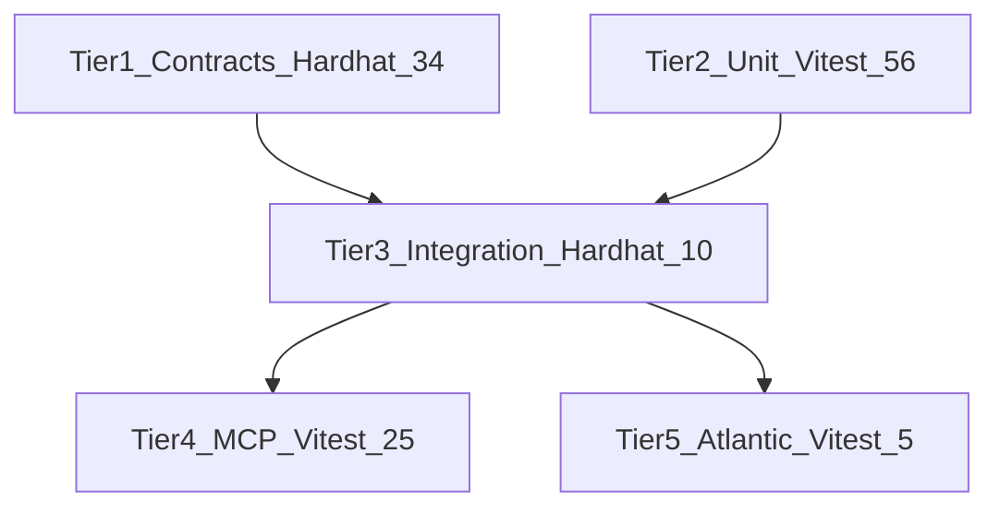

# Test suite

**130 tests** across 5 tiers (44 Hardhat + 86 Vitest). Verified: `npm test` (exit 0).

```bash
npm test                  # build + hardhat test + vitest run
npm run test:contracts    # Hardhat contracts only
npm run test:integration  # SDK integration only
npm run test:unit         # Vitest excluding Atlantic
npm run test:atlantic     # Atlantic RPC smoke only
```

## Pyramid



| Tier | Runner | Files | Tests |
|------|--------|-------|-------|
| 1 Contracts | Hardhat | `test/contracts/*.test.cjs` | 34 |
| 2 Unit | Vitest | `test/unit/*.vitest.ts`, `test/cursor-global-mcp.vitest.ts` | 56 |
| 3 Integration | Hardhat | `test/integration/*.test.cjs` | 10 |
| 4 MCP | Vitest | `test/mcp/*.vitest.ts` | 25 |
| 5 Atlantic | Vitest | `test/atlantic/*.vitest.ts` | 5 |

## Layout

```
test/
├── contracts/       # On-chain Hardhat tests
├── integration/     # SDK vs in-process Hardhat
├── unit/            # Pure TS + mock API
├── mcp/             # MCP tool smoke
├── atlantic/        # Live Atlantic reads
├── helpers/         # Shared fixtures
├── fixtures/        # JSON fixtures
└── setup.ts         # dotenv for Vitest
```

## Config

- **Hardhat:** `hardhat.config.cjs` — `test/contracts/**`, `test/integration/**`
- **Vitest:** `vitest.config.ts` — `test/**/*.vitest.ts`, 120s timeout, sequential

## Tier docs

- [Tier 1: Contracts](tier-contracts.md)
- [Tier 2: Unit](tier-unit.md)
- [Tier 3: Integration](tier-integration.md)
- [Tier 4: MCP](tier-mcp.md)
- [Tier 5: Atlantic](tier-atlantic.md)
- [Troubleshooting](troubleshooting.md)

## Optional Atlantic E2E

```bash
ATLANTIC_E2E=1 npm run test:atlantic
```

Full micro-settle on Atlantic (costs TEST + RPC). Off by default.
