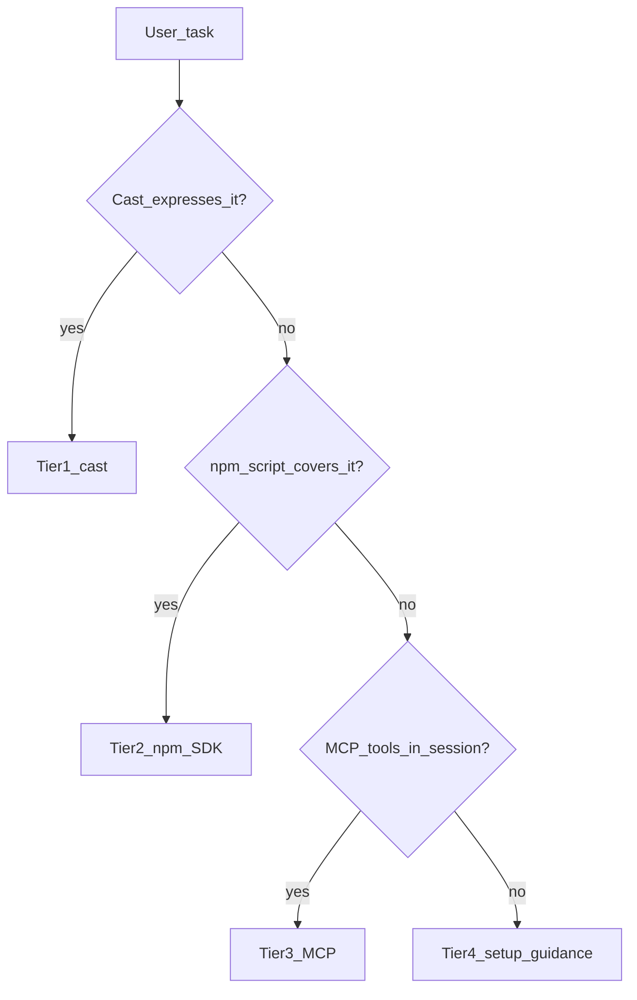

# Progressive Execution Resolution

> **Rule:** If cast cannot **safely or fully express** the workflow → escalate upward.  
> Agents decide; **MCP is never auto-enabled**.

## Terminology

| Term | Meaning |
|------|---------|
| **SDK** | TypeScript library `pharos-trusted-settlement` in `src/` — shared by npm scripts and MCP |
| **Tier 2 npm scripts** | `package.json` scripts (`pay:once`, `demo:judge`, `batch:fund`, …) that call the SDK |
| **Tier 3 MCP** | MCP server in `mcp/` — orchestration layer that also calls the SDK |

## Execution Priority Order

| Tier | Name | Role |
|------|------|------|
| **1** | **cast** | Atomic on-chain execution (default) |
| **2** | **npm scripts** | Composed SDK shortcuts when cast cannot express the workflow |
| **3** | **MCP** | Orchestration + intelligence when npm is insufficient and tools are connected |
| **4** | **setup guidance** | Human action when tiers 1–3 are unavailable |

### Tier examples

| Tier | Examples |
|------|----------|
| 1 — cast | `fundAndAcceptHybrid`, `submitDelivery`, `claim`, `reclaim`, `rejectDelivery`, `resolveDispute` |
| 2 — npm | `pay:once`, `pay:once --simulate`, `batch:fund`, `batch:claim`, `agent:doctor`, `demo:judge`, `demo:ghost-payer` |
| 3 — MCP | `simulate_trusted_settlement`, `get_settlement_status`, `mock: true`, batch manifests, `execute_trusted_settlement` |
| 4 — setup | `npm run setup`, `npm run mcp:install-global`, reload MCP in IDE Settings — [docs/mcp/modes.md](../docs/mcp/modes.md) |

---

## Foundry gate (pre-check #0)

Before tier 1 cast, run `cast --version`. **Clone + `npm install` does not install Foundry.**

| Result | Agent action |
|--------|--------------|
| `cast` works | Continue pre-checks #1–#4 |
| `command not found` / fails | Stop cast path; offer choices below — do **not** auto-install |

### Foundry missing — offer choices

```
Foundry (cast) is not installed — cast-first path unavailable.

A) Install Foundry (then retry cast):
   curl -L https://foundry.paradigm.xyz | bash && foundryup
   cast --version
   (Windows: Git Bash / WSL, or Foundry Windows installer)

B) Tier 2 — npm SDK (reads .env; no cast needed):
   npm run pay:once -- --payee 0x... --amount 1 --work "task"

C) Tier 3 — MCP (if pharos-settle connected in this session):
   fund_deal / execute_trusted_settlement

D) Mock demo (no keys):
   npm run demo:judge
```

If user insisted on **cast only** → require **A** before proceeding. Do not silently use npm/MCP.

---

## Cast key gate (tier 1 writes)

Before any `cast send`, run pre-check #2. If `$PRIVATE_KEY` is missing or invalid:

| User intent | Agent action |
|-------------|--------------|
| Live settlement (fund, deliver, claim, …) | **Prompt for keys** — see template below; do not run writes |
| Read-only (balance, `getDeal`, `canClaim`) | Proceed without key |
| Mock / demo / no keys | Escalate tier 2 (`demo:judge`) or tier 3 (`mock: true`) — do **not** prompt for keys |

### Key prompt template (live cast writes)

```
No PRIVATE_KEY available for cast writes.

To settle live on Atlantic:
1. cp .env.example .env
2. PRIVATE_KEY=0x...        (payer — 66+ char hex)
3. AGENT_B_PRIVATE_KEY=0x... (payee — only if deliver/claim steps needed)
4. export PRIVATE_KEY=0x...  (required — cast does not read .env automatically)
5. Fund PHRS on Atlantic testnet
6. Confirm: cast wallet address --private-key $PRIVATE_KEY

Or say "mock demo" for npm run demo:judge (no keys).
```

| Path | Where keys live | Who loads them |
|------|-----------------|----------------|
| **cast** | Shell env vars (`$PRIVATE_KEY`, `$RPC`) | Agent loads from `.env` into shell when user confirms — see below |
| **npm / MCP** | `.env` in repo clone | SDK reloads per request |

### When user confirms keys are set — stay on cast

If the user saved `.env` and says **“keys are set, proceed”** (or similar):

1. **Do not switch tier** — continue cast (tier 1). Do not jump to npm/MCP unless cast is still impossible.
2. **Load `.env` into the agent’s shell** (cast does not read the file by itself), then re-run pre-check #2.

**bash / zsh / Git Bash:**

```bash
set -a && source .env && set +a
export RPC=${PHAROS_RPC_URL:-https://atlantic.dplabs-internal.com}
cast wallet address --private-key $PRIVATE_KEY
```

**PowerShell (Windows):**

```powershell
Get-Content .env | ForEach-Object {
  if ($_ -match '^\s*([^#=]+)=(.*)$') { Set-Item -Path "env:$($matches[1].Trim())" -Value $matches[2].Trim().Trim('"').Trim("'") }
}
$env:RPC = if ($env:PHAROS_RPC_URL) { $env:PHAROS_RPC_URL } else { "https://atlantic.dplabs-internal.com" }
cast wallet address --private-key $env:PRIVATE_KEY
```

3. If pre-check #2 **passes** → continue the cast workflow from `references/settlement.md` Method A.
4. If pre-check #2 **still fails** → keys missing/invalid in `.env`; prompt again. Only then offer tier 2 (`npm run pay:once`) as fallback — not MCP setup unless tier 3 is required.

Never ask the user to paste the private key into chat. Never commit `.env`.

---

## Decision flow

```
Can cast express it directly?
  → yes: use cast (tier 1)
  → no:
      Does an npm script cover it?
        → yes: use npm (tier 2)
        → no:
            Are pharos-settle MCP tools in this session?
              → yes: use MCP (tier 3)
              → no: give setup instructions (tier 4)
```



---

## Task → tier matrix

| Task | Tier 1 cast | Tier 2 npm | Tier 3 MCP |
|------|-------------|------------|------------|
| Check balance / read deal | Yes | `check:balance` | `get_settlement_status` |
| Single fund / deliver / attest / claim | Yes | `pay:once` | `fund_deal`, `submit_delivery`, `attest_release`, `complete_claim_for_deal` |
| Ghost reclaim / reject / dispute | Yes | `demo:ghost-payee`, `demo:ghost-payer` | `reclaim_trusted_settlement`, `reject_delivery`, `resolve_dispute` |
| Batch payroll | Loop (manual `dealId` tracking) | `batch:fund` → `batch:claim` | `fund_deals_batch` → `complete_claims_batch` |
| Hybrid batch (deliver + attest × N) | Many `cast send` loops | `demo:batch`, `demo:batch:split` | `submit_deliveries_batch`, `attest_releases_batch` |
| Mock / no keys | No | `demo:judge`, `agent:doctor:mock` | `mock: true` on any tool |
| Doctor / readiness | Manual checks only | `agent:doctor` | `get_agent_readiness` |
| Simulate + preflightHash + fee quote | No (`cast estimate` = gas only) | `pay:once --simulate` | `simulate_trusted_settlement` |
| nextAction polling | No | — | `get_settlement_status` |
| One-shot both keys (full flow) | No | `pay:once`, `pay:batch` | `execute_trusted_settlement`, `execute_batch_settlement` |
| Auto-onboard payee | Separate register tx | `pay:once` (SDK flag) | `autoOnboardRecipients: true` |
| Deploy contracts | `npm run deploy:pharos` | same | — |

---

## Agent escalation message template

Use when cast cannot express the workflow and you need tier 2+:

```
This workflow cannot be fully expressed with cast alone.

→ Tier 2 (terminal): [npm run … if applicable]
→ Tier 3 (IDE): use MCP tool [name] if pharos-settle is connected in this session
→ Tier 4 (setup): if MCP is needed but not connected:
    1. npm run setup (in repo clone)
    2. Project MCP (repo as workspace root) OR npm run mcp:install-global (any workspace)
    3. Reload pharos-settle in Cursor Settings → MCP

MCP is not auto-enabled — you must install and reload it.
```

---

## Anti-patterns

| Do not | Do instead |
|--------|------------|
| Say “MCP will turn on automatically” | Say “escalate to MCP if connected; otherwise setup instructions” |
| Claim MCP is connected when tools are missing | State: “Pharos Settle MCP is not connected in this session.” |
| Skip tier 2 when `pay:once` / `demo:judge` fits | Try npm script before asking for MCP setup |
| Ask global/local MCP or demo/live before cast pre-checks | Only at tier 4 or when tier 3 is required |
| Use cast for `mock: true` or `nextAction` | Escalate to tier 2 or 3 |

---

## Wording guardrails

| Avoid | Use instead |
|-------|-------------|
| “automatically turn on MCP” | “escalate to MCP if available” |
| “system switches to MCP” | “agent should use MCP tools when connected” |
| “cast falls back to MCP” | “cast cannot express this → try npm, then MCP” |
| MCP setup before every task | MCP setup only at tier 4 or when tier 3 required |
