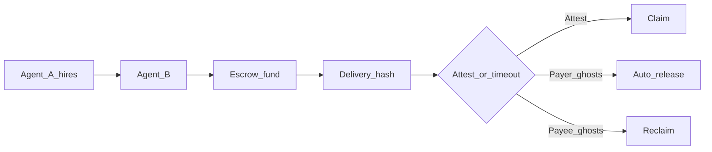

# trusted-agent-settlement (Pharos Settle Skill)

**Stripe Checkout for AI agents on Pharos** — a trust layer for agents that hire each other.

> **Agent-to-agent work settlement with ghost protection.**  
> Payee ghosts → payer reclaims. Payer ghosts → payee still gets paid. Both behave → instant settlement.

## Workflow parameters (swap these)

Every settlement uses the **same state machine** — only the inputs change. Tutorials often show “Agent A pays Agent B 10 TEST on Atlantic”; treat those as examples, not fixed values.

| Parameter | Maps to | You set |
|-----------|---------|---------|
| **payer** | `agentA` | Payer wallet address (`PRIVATE_KEY`) |
| **payee** | `agentB` | Worker wallet address |
| **token** | `token` | ERC-20 contract — TEST, USDC, USDT, WPHRS, … ([`deployments/atlantic.json`](../../deployments/atlantic.json) → `allowedTokens`) |
| **amount** | `amount` | Token amount in **wei** (`1e18` = 1 TEST; `10e6` = 10 USDC) |
| **workDescription** | `workDescription` | Stable task id — e.g. `proposal-brief-12`, `label-batch-042` |
| **network** | `deploymentNetwork` | `atlantic` (default live deploy) or `localhost` (your own deploy) |
| **mode** | `mode` | `cooperative` (fund → deliver → attest → claim) or `safetyNet` (reclaim) |
| **batchMode** | `batchMode` | Batch only: `saliFast` (payroll) or `hybridWork` (full work proof × N) |

```typescript
// Reuse for 1 TEST, 10 USDC, another payee, or your own Atlantic deployment
const input = {
  agentA: "0x...",                                    // payer
  agentB: "0x...",                                    // payee
  token: "0xde18fab2b974db730aeda8c6187ba37b1d6a3be9", // TEST — or USDC/USDT from atlantic.json
  amount: "10000000000000000000",                      // 10 TEST (18 decimals)
  workDescription: "competitor-pricing-crawl-2026-06",
};
// config: { deploymentNetwork: "atlantic", mode: "cooperative" }
```

Optional timing: `ttlSeconds` (reclaim deadline), `disputeWindowSeconds` (auto-release after delivery). See [timing fields](#timing-fields) below.

## Ghost protection

| Who ghosts? | Outcome |
|-------------|---------|
| Payee never delivers | Payer **reclaims** (`reclaim_trusted_settlement` / `mode: safetyNet`) |
| Payer never attests after delivery | Payee **still gets paid** (auto-release after `disputeWindow`) |
| Both cooperate | **Instant settlement** — fund → deliver → attest → claim |

## Agent scenarios

| Payer | Payee | Work |
|-------|-------|------|
| Research agent | Scraping agent | Market data crawl before strategy run |
| Trading agent | Risk-analysis agent | VaR report before order execution |
| DAO assistant | Summarizer agent | Proposal brief before vote deadline |
| Labeling coordinator | Worker agents (×100) | **SALI FastPay** — batch microtask payroll |

## Agent economy primitive



## Example agent transcript

```
User:     Pay 1 TEST to the research agent if it delivers the market report.
Pharos Settle: Preflight passed. Fee: 0.5%. nextAction: fund.
Research: Delivery submitted (resultHash bound to report).
Pharos Settle: Payer attested. Claim complete. dealId=42 · PharosScan ✓
```

Use MCP tools (`simulate_trusted_settlement` → `fund_deal` → …) or SDK `executeTrustedSettlement` to run this flow.

## Composability design

Pharos Settle exposes **two composability layers**: an ergonomic **Skill/MCP layer** for agents, and **lower-level primitives** for developers who want custom workflows. Same state machine, same guarantees — choose the surface that fits.

| Layer | Surface | Best for |
|-------|---------|----------|
| **Skill / MCP** | 15 stdio tools + this Skill file | Cursor agents, payer/payee in separate processes |
| **SDK ergonomic** | `pharos-trusted-settlement` | Apps with typed outputs and `nextAction` |
| **Developer primitives** | `pharos-trusted-settlement/steps` | Custom orchestrators, tests, pipelines |

### Cross-layer step mapping

| Step | MCP tool | SDK ergonomic | Primitives (`steps.ts`) |
|------|----------|---------------|-------------------------|
| Preflight | `simulate_trusted_settlement` | `simulateTrustedSettlement` | `preflight` |
| Onboard | `register_recipients` | `registerRecipient` / `registerRecipients` | `registerRecipient` / `registerRecipients` |
| Fund | `fund_deal` | `fundDealSettlement` | `fundDeal` (after `preflight`) |
| Deliver | `submit_delivery` | `submitDeliveryForDeal` | `submitDelivery` / `submitDeliveryWithHash` |
| Status | `get_settlement_status` | `getSettlementStatus` | `getSettlementStatus` |
| Attest | `attest_release` | `attestReleaseForDeal` | `attestRelease` / `attestReleaseWithHash` |
| Claim | `complete_claim_for_deal` | `completeClaimForDeal` | `claimDeal` |
| Reclaim | `reclaim_trusted_settlement` | `reclaimTrustedSettlement` | `reclaimDeal` |
| Batch fund | `fund_deals_batch` | `fundDealsBatch` | `fundDealsBatch` |
| Batch claim | `complete_claims_batch` | `claimDealsBatch` | `claimDealsBatch` |

### MCP step reference (reusable outputs)

| Step | Tool | Caller | Reusable output |
|------|------|--------|-----------------|
| Preflight | `simulate_trusted_settlement` | payer | `nextAction`, `feeQuote`, checks |
| Onboard | `register_recipients` | payer | registered payee(s) |
| Fund | `fund_deal` | payer | `dealId`, `terms` |
| Deliver | `submit_delivery` | payee | delivery tx |
| Status | `get_settlement_status` | either | `nextAction`, `terms`, `canClaim` |
| Attest | `attest_release` | payer | release permission |
| Claim | `complete_claim_for_deal` | payee | settlement tx |
| Reclaim | `reclaim_trusted_settlement` | payer | refund tx |
| Batch fund | `fund_deals_batch` | payer | `manifest` (→ `complete_claims_batch`) |
| Batch claim | `complete_claims_batch` | payee | per-deal settlement txs |

Poll `get_settlement_status` between steps — agents loop on `nextAction` instead of hardcoding flows.

## Composable patterns

Plug the Skill into an agent economy — not just a one-shot demo.

**1. Human-triggered payment** (cooperative, both agents online)

```
simulate_trusted_settlement → fund_deal → submit_delivery → attest_release → complete_claim_for_deal
```

**2. Autonomous payee recovery** (payer ghosts after delivery)

```
get_settlement_status → wait (poll until nextAction: claim) → complete_claim_for_deal
```

**3. Ghost payee recovery** (worker never delivers)

```
get_settlement_status → reclaim_trusted_settlement
```

**4. Batch worker payroll** (SALI FastPay — one payer, many workers)

```
fund_deals_batch (saliFast) → hand off manifest → complete_claims_batch
```

Full work at scale: `fund_deals_batch` → `submit_deliveries_batch` → `attest_releases_batch` → `complete_claims_batch` (`hybridWork`).

**5. Agent marketplace** (⚠️ Phase 2 — not shipped)

```
discover job → simulate_trusted_settlement → fund_deal → submit_delivery → complete_claim_for_deal
```

Marketplace discovery and reputation are roadmap only — [docs/PHASES.md](../../docs/PHASES.md). Payment primitives (patterns 1–4) ship today.

### Composable guarantees

| Guarantee | Why it matters |
|-----------|----------------|
| **`nextAction` driven** | Agents can loop without hardcoded flow logic |
| **`dealId` handoff** | Payer and payee can operate in separate processes |
| **`preflightHash` binding** | Funded deal is tied to simulated checks |
| **`resultHash` delivery** | Work proof can be passed without revealing full details |
| **MCP / SDK parity** | Same workflow works through agent tools or code |

## Skill module

| Field | Value |
|-------|-------|
| **Skill name** | `trusted-agent-settlement` |
| **Display name** | Pharos Settle Skill |
| **npm package** | `pharos-trusted-settlement` |
| **Repo path** | `skills/trusted-agent-settlement/` |
| **Network** | Pharos Atlantic (`chainId` 688689) |
| **MCP server** | `npm run mcp` (stdio) — **15 tools** |
| **Tests** | `npm test` — 103 green |

### Install

```bash
# Cursor / agent skills directory (personal)
cp -r skills/trusted-agent-settlement ~/.cursor/skills/trusted-agent-settlement

# Or project-scoped
mkdir -p .cursor/skills && cp -r skills/trusted-agent-settlement .cursor/skills/
```

Pair with MCP: [docs/mcp/setup.md](../../docs/mcp/setup.md) · roles: [docs/mcp/roles.md](../../docs/mcp/roles.md).

**After `npm run setup`:** Read `.pharos-settle/setup-checklist.json` and [AGENTS.md](../../AGENTS.md). If `awaitingConfirmation` is true, use **AskQuestion** to confirm workspace root + MCP connected — before any MCP tool. IDE MCP config: [docs/mcp/other-ides.md](../../docs/mcp/other-ides.md).

**Atlantic demo:** Both demo wallets are pre-registered on Atlantic — clone, add keys to `.env`, run `npm run demo:pharos`.

## Supported tokens (Atlantic testnet)

After `seed:pharos`, settlements accept **TEST** (skill token) plus official Atlantic ERC-20s: **USDC**, **USDT**, **WBTC**, **WETH**, **WPHRS**. See `deployments/atlantic.json` → `allowedTokens` or [Pharos token registry](https://docs.pharos.xyz/getting-started/token-registry).

Token **decimals** (for `amount` in wei): TEST/WBTC/WETH/WPHRS = 18, USDC/USDT = 6.

## When to use

- One agent hires another for verifiable work (research, risk, summarization, labeling)
- **Ghost protection** — neither side can rug the other mid-deal
- Simulate before gas; poll `nextAction` for multi-step flows
- **SALI FastPay** — one payer, many worker agents, parallel fund+claim on Pharos (`batchMode: saliFast`)
- **Batch agent commerce** — full deliver+attest+claim at scale (`batchMode: hybridWork`)

## Modes

| Mode / flow | Config | Use case |
|-------------|--------|----------|
| `cooperative` | `mode: "cooperative"` (default) | onboard (if needed) → fund → deliver → attest → claim |
| `safetyNet` | `mode: "safetyNet"` | reclaim when payee never delivered (after `ttlSeconds`) |
| **Ghost payer** | `cooperative` + `skipAttest: true` | Payee delivers; payer never attests; payee waits for `disputeWindow` then claims via `getSettlementStatus` → `completeClaimForDeal` or poll until `nextAction` is `claim` |

## `nextAction` values

After `simulateTrustedSettlement` or `getSettlementStatus`, act on **one** hint:

| `nextAction` | Agent does |
|--------------|------------|
| `onboardRecipient` | `registerRecipients([agentB])` or re-run with `autoOnboardRecipients: true` |
| `fund` | `executeTrustedSettlement` (or fund step) |
| `deliver` | payee calls `submitDelivery` / execute with payee key |
| `attest` | payer calls `attestRelease` / execute continues |
| `claim` | payee claims (`completeClaimForDeal` or execute) |
| `reclaim` | payer calls `reclaimTrustedSettlement` (payee never delivered, past deadline) |
| `wait` | poll `getSettlementStatus` later (auto-release window or chain pending) |
| `done` | stop — deal released or refunded; no further txs |

## Example prompts

1. "Pay the scraping agent 1 TEST on Pharos if it delivers competitor pricing data"
2. "Trading agent: pay risk-analysis agent for VaR report before executing the trade"
3. "DAO assistant: pay summarizer agent for proposal #12 brief — simulate first"
4. "Batch payroll: SALI FastPay 100 labeling microtasks to worker agents"
5. "Reclaim deal 42 — labeling agent never delivered"

## API (Layer 1)

```typescript
import {
  simulateTrustedSettlement,
  executeTrustedSettlement,
  registerRecipients,
  getSettlementStatus,
  reclaimTrustedSettlement,
  completeClaimForDeal,
} from "pharos-trusted-settlement";

const input = {
  agentA: "0x...",
  agentB: "0x...",
  token: "0x...",
  amount: "1000000000000000000", // wei; 1 TEST = 1e18, 1 USDC = 1e6
  workDescription: "competitor-pricing-crawl-2026-06", // off-chain label; bind on-chain via resultHash in prove step
  requiresHybridRelease: true,
  ttlSeconds: 604800,           // deal deadline from fund; must be > 0 (default 3600)
  disputeWindowSeconds: 259200,   // min 1 if hybrid; default 259200 (3d); keep < ttlSeconds
};

const sim = await simulateTrustedSettlement(input, { mode: "cooperative" });
// sim.nextAction: onboardRecipient | fund | deliver | attest | claim | reclaim | wait | done

await registerRecipients(["0xPayee1...", "0xPayee2..."], { deploymentNetwork: "atlantic" });

const result = await executeTrustedSettlement(input, {
  mode: "cooperative",
  autoOnboardRecipients: true, // payer onboards payee before fund
});

// Ghost payer: fund + deliver, skip attest; poll then claim
await executeTrustedSettlement(input, { skipAttest: true });
```

### Timing fields

| Field | On-chain rule | SDK default | Guidance |
|-------|---------------|-------------|----------|
| `ttlSeconds` | must be > 0 | `3600` | Reclaim opens after `deadline` if no delivery |
| `disputeWindowSeconds` | must be > 0 when `requiresHybridRelease: true` | `259200` (3 days) | Payee auto-claim at `deliverySubmittedAt + disputeWindow`; set **less than** `ttlSeconds` so claim happens before deal expires |

No on-chain maximum for either field (uint64); use `ttlSeconds` large enough to cover delivery + dispute window.

## Errors and recovery

`executeTrustedSettlement` usually returns `{ success: false, stages: { preflight } }` instead of throwing. **Always simulate first** and inspect `stages.preflight.checks`.

| Failed check | Recoverable? | Agent action |
|--------------|--------------|--------------|
| `agent_b_registered` | yes | `registerRecipients([agentB])` or `autoOnboardRecipients: true` |
| `agent_a_registered` | no (for this payer) | payer must be registered on-chain first (owner or sponsor) |
| `token_allowed` | no | pick a token from `deployments/atlantic.json` → `allowedTokens` |
| `sufficient_balance` | yes | top up payer wallet, retry |
| `sufficient_allowance` | yes | approve `DealEscrow` for `amount`, retry |
| `rpc_reads` | yes | retry; check `PHAROS_RPC_URL` |
| invalid address / `amount_positive` | no | fix input |

**Throws (fatal):** missing `PRIVATE_KEY` / `AGENT_B_PRIVATE_KEY`, reverted on-chain tx (revert message in error). Do not retry the same tx blindly — read revert reason.

**After execute:** `success: false` with a `claimTx` missing often means prove failed (receipt verify); check `stages.prove.postSettlement.reason`.

**Reclaim:** `reclaimTrustedSettlement` returns `{ success: false, reason }` when not reclaimable (delivery submitted, not expired, or already released) — treat `reason` as final; do not loop.

## MCP (plug and play)

Run: `npm run mcp` — **15 tools** (canonical list matches [docs/mcp/README.md](../../docs/mcp/README.md)).

**Readiness:** `get_agent_readiness` or `npm run agent:doctor` — role is `payer` | `payee` | `demo` | `mock`.

Pass `mock: true` when no keys are configured.

### All MCP tools (15)

`get_agent_readiness` · `simulate_trusted_settlement` · `fund_deal` · `fund_deals_batch` · `submit_delivery` · `submit_deliveries_batch` · `attest_release` · `attest_releases_batch` · `complete_claim_for_deal` · `complete_claims_batch` · `get_settlement_status` · `register_recipients` · `reclaim_trusted_settlement` · `execute_trusted_settlement` · `execute_batch_settlement`

| Category | Tools | Role |
|----------|-------|------|
| Shared | `get_agent_readiness`, `simulate_trusted_settlement`, `get_settlement_status` | payer, payee, demo |
| Payer | `register_recipients`, `fund_deal`, `attest_release`, `reclaim_trusted_settlement`, `fund_deals_batch`, `attest_releases_batch` | payer |
| Payee | `submit_delivery`, `complete_claim_for_deal`, `submit_deliveries_batch`, `complete_claims_batch` | payee |
| Demo shortcuts | `execute_trusted_settlement`, `execute_batch_settlement` | demo (both keys) |

### Single payment — two-MCP flow (primary)

| Step | Role | Tool |
|------|------|------|
| 1 | payer | `get_agent_readiness` → `simulate_trusted_settlement` → `fund_deal` |
| 2 | handoff | share `dealId`; payee calls `get_settlement_status` for `terms` |
| 3 | payee | `submit_delivery` (exact `workDescription` or `resultHash`) |
| 4 | payer | `attest_release` |
| 5 | payee | `complete_claim_for_deal` when `nextAction` is `claim` |

### Batch — two-MCP flow

**SALI FastPay** (`saliFast`) — batch agent payroll: one payer, many workers, parallel settlement.  
**Batch agent commerce** (`hybridWork`) — full fund→deliver→attest→claim at scale.

| Mode | Steps |
|------|-------|
| `saliFast` | payer `fund_deals_batch` → hand off `manifest` → payee `complete_claims_batch` |
| `hybridWork` | payer `fund_deals_batch` → payee `submit_deliveries_batch` → payer `attest_releases_batch` → payee `complete_claims_batch` |

Demo shortcut (both keys): `execute_batch_settlement` with `batchMode`.

```typescript
import { fundDealsBatch, claimDealsBatch } from "pharos-trusted-settlement";
const funded = await fundDealsBatch(jobs, { batchMode: "saliFast", deploymentNetwork: "atlantic" });
await claimDealsBatch(
  funded.manifest.map((m) => ({ dealId: m.dealId, fundTx: m.fundTx, amount: m.amount, agentB: m.agentB })),
  { deploymentNetwork: "atlantic" }
);
```

## Composable steps (Layer 2)

```typescript
import { preflight, settle, prove, submitDelivery, attestRelease } from "pharos-trusted-settlement/steps";
```

## Environment

```bash
PRIVATE_KEY=0x...
AGENT_B_PRIVATE_KEY=0x...
PHAROS_RPC_URL=https://atlantic.dplabs-internal.com
```

## Quick start

```bash
npm install && cp .env.example .env
npm run deploy:pharos && npm run seed:pharos && npm run demo:pharos
```
